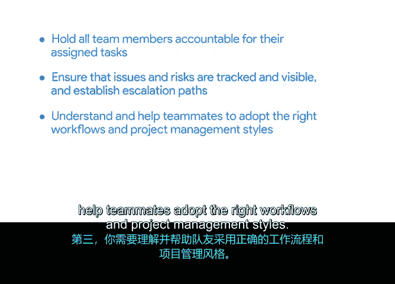

# 016：项目经理在团队中的角色 🧩

在本节课中，我们将要学习项目经理在项目团队中的具体角色，以及他们如何与团队中的其他成员协作。我们将明确项目经理并非团队成员的直接上级，而是项目的协调者和推动者。

上一节我们介绍了项目经理的职责，本节中我们来看看项目经理如何在实际团队中定位自己的角色。

听到“经理”这个词，人们通常会联想到自己的上司。但项目经理通常并非项目团队成员的直接管理者。我们在此讨论的项目经理，是负责管理项目任务的人。

但这具体意味着什么？虽然你可能与几位队友共同负责一个项目，但你很可能不是他们日常工作的上级。在团队的帮助下，你们可以共同完成更多工作。团队中的每位成员都有各自的角色和职责，你们需要协同合作，确保每个人都能完成自己的任务以推动项目进展。

每个人都是其负责部分的专家，但没有人能精通项目的所有方面。坦率地说，你也不会是。

例如，平面设计师专注于平面设计，但可能并非文案写作的专家。同样，你是项目管理的专家，但可能并非市场营销的专家。

我们可以用另一种方式来理解。想象你正在组织一次露营旅行。你可能是负责规划这次旅行的人，但这并不意味着你必须是一位露营专家。也许你从未露营过，但你的伙伴从小就在篝火旁度过每个夏天。在这种情况下，你可以将“为团队挑选合适数量和款式的帐篷”这个任务分配给他。

在这个例子中，你通过将挑选帐篷的任务分配给伙伴来规划这次旅行，以确保每个人都能得到照顾。你并没有亲自去做调研或执行任务，但你确保了事情得以完成。

在工作场所中情况是类似的。作为项目经理，你无需成为每个项目角色的专家。这没关系。正如我们所说，你的工作不是成为所有领域的专家。相反，你的职责是引导团队，并确保他们获得完成项目所需的支持。

那么，项目经理具体如何做到这一点呢？让我们通过几个在职位描述中可能出现的职责要求来进一步讨论。

以下是项目经理在团队协作中的几项关键职责：

*   **第一，你需要确保所有团队成员对其分配的任务负责。** 通过任务管理，赋予团队成员对项目特定部分的自主权，有助于你让他们承担责任。
*   **第二，你需要确保问题和风险被跟踪并可见，并能够建立上报路径。** “上报路径”指的是，你应该知道如何在正确的时间将风险传达给正确的人。
*   **第三，你需要理解并帮助团队成员采用正确的工作流程和项目管理风格。** 作为项目经理，你最清楚哪种风格最适合当前的工作。你的职责是确保团队遵守该风格及其他既定流程。
*   **第四，你需要与组织内的其他团队协作，以满足基于项目范围、时间表和预算的要求。** 换句话说，一个项目可能不仅影响你的团队，也会影响组织内的其他团队，例如市场部或财务部。因此，你需要与这些团队合作，确保各方对项目成果都感到满意。

你将在后续课程中了解更多关于与其他利益相关者协作的内容。

本节课中我们一起学习了项目经理在团队中的角色定位。我们了解到，项目经理通常不是团队成员的直接上级，而是负责引导团队成员，并确保他们获得完成项目所需支持的关键角色。

现在你已经对项目经理如何融入项目团队有了清晰的认识，让我们继续前进，在下一节中讨论项目经理取得成功所需具备的技能类型。我们下一节见。