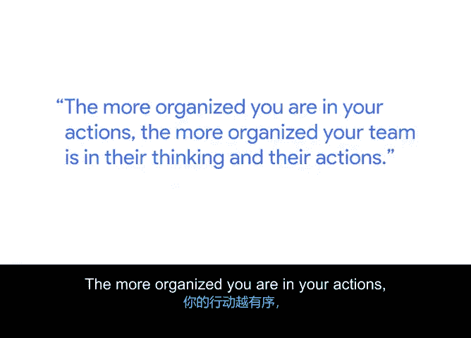
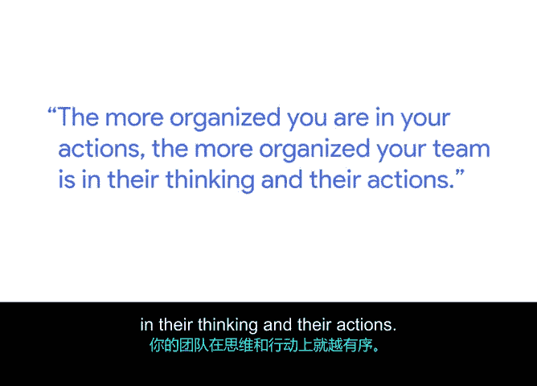
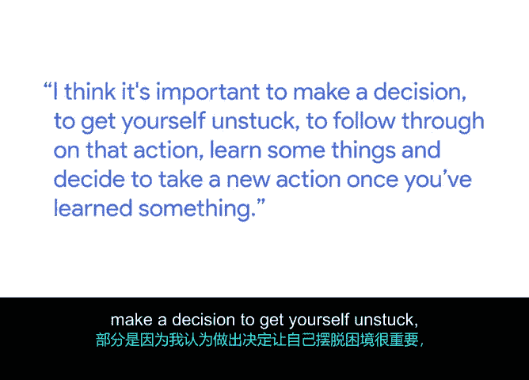

# 017：项目经理的一天 🗓️

在本节课中，我们将跟随谷歌高级工程项目经理艾丽塔，了解项目经理典型的一天工作内容。我们将探讨项目经理的角色定位、日常职责以及保持高效的关键方法。

## 项目经理的角色定位 🎭

上一节我们介绍了项目管理的基础概念，本节中我们来看看项目经理的具体角色。一位出色的项目经理是急救员、忍者和爵士音乐家的奇妙结合。

*   **急救员**：项目经理需要出现在充满混乱的现场，判断当前需要做什么，对现场所有事项进行优先级排序，然后制定行动计划，同时参与执行。
*   **忍者**：项目经理需要以巧妙、不引人注目的方式影响他人。过于直接的行动或给他人过大压力，效果往往不佳。
*   **爵士音乐家（尤其是鼓手）**：当团队中发生许多事情时，项目经理需要保持稳定的节奏。团队中会有许多才华横溢的成员，项目经理需要确保每个人都在正确的节拍上协同工作。

## 日常核心职责与沟通 📞

了解了项目经理的多重角色后，我们来看看这些角色如何体现在日常工作中。艾丽塔大部分时间都与产品和工程部门的同事在一起。

以下是她的核心工作内容：
*   讨论大量战略问题。
*   向关键相关方更新项目状态。
*   规划产品的下一步发展方向。

从她工作的第一天起，有些事从未改变，那就是**大量的沟通**。她每天需要与许多不同类型的人交流，包括工程师、产品经理、合作伙伴、销售和市场营销人员。最大的变化在于沟通对象的数量以及所讨论话题的复杂性。

## 保持高效的关键：组织与清单 📝

高效的沟通和管理离不开良好的组织能力。你个人和你的行动越有条理，你的团队在思考和行动上也就越有条理。

艾丽塔保持条理的方法是持续使用清单。她使用便利贴、电子清单和邮件中的清单。这些清单帮助她掌握：
*   当前需要采取的行动。
*   接下来需要采取的行动。
*   可以推迟几天再处理的事项。

她利用清单来管理时间，最重要的是确保自己清楚**今天需要完成什么**。一旦清单确定，她就会为这些事项分配时间。

## 团队同步：站会 🕙

清单帮助个人保持条理，而站会则帮助团队保持同步。站会是一种简短的会议，通常在一天开始时举行，但任何时间都可以进行。

艾丽塔的站会通常在上午9:30或10点进行，取决于工程团队的到岗时间。会议持续约15分钟，目的是明确：
*   前一天完成了哪些工作。
*   当天计划完成哪些工作。

团队通常在午餐时间快速检查一次，以确保大家仍在正轨上，或者确认是否遇到了需要更长时间解决的技术问题。

## 优秀项目经理的特质：行动力与韧性 ⚡

最后，我们来探讨是什么造就了一位优秀的项目经理。艾丽塔认为关键在于**行动偏好**和**韧性**。

她最喜欢的一句话是“做出决定并坚持执行”。部分原因在于，她认为做出决定以摆脱困境、执行该行动、从中学习并根据新信息决定采取新行动，这非常重要。

韧性的体现是，如果团队采取了一个错误的行动，他们能够从中学习，并根据新信息调整方向。

---

本节课中我们一起学习了项目经理的多元角色、日常沟通与战略工作、通过清单保持个人条理、利用站会保持团队同步，以及行动力与韧性这两项核心特质。记住，有效的项目管理始于有条理的个人和清晰的团队节奏。