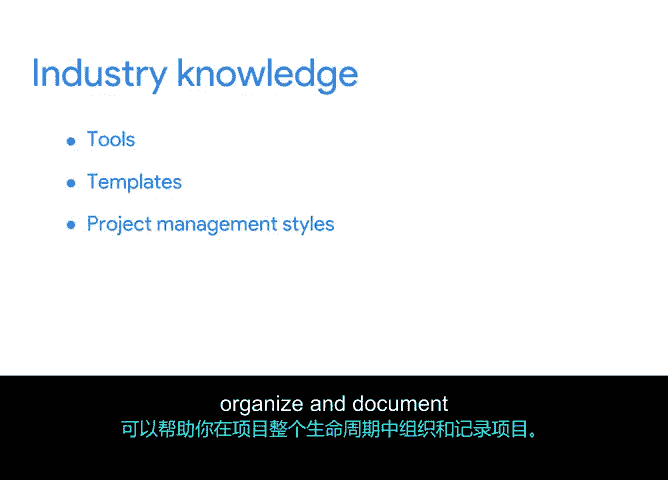

# 018：项目经理的核心技能 🎯

在本节课中，我们将探讨项目经理为胜任其角色所需具备的核心技能。这些技能是确保项目顺利进行并达成目标的基础。

上一节我们介绍了项目经理的角色与职责，本节中我们来看看支撑这些职责的关键能力。项目经理可以具备多种技能，但我们认为有四项核心技能集对项目的成功至关重要：**促进决策**、**沟通与上报**、**灵活性**以及**强大的组织能力**。

## 促进决策 🤝

促进团队内部决策或从适当的领导者处获取决策的能力，对于保持项目按计划进行并实现目标至关重要。

项目中大量的日常决策很可能需要你和你的团队成员共同讨论并达成一致。你将通过收集团队成员的信息，并利用这些信息帮助团队做出明智的决策，从而确保项目按计划推进。同时，你还需要确保这些决策被传达给必要的同事，无论是直接团队还是公司领导层。

以下是促进决策的几个关键点：
*   收集并整合来自团队成员的信息。
*   利用信息帮助团队在选项之间做出明智选择。
*   将最终决策清晰地传达给所有相关方。

## 沟通与上报 📢

作为项目经理，你几乎在所有工作中都会运用到沟通技巧。

这可以体现为记录计划、发送关于项目状态的电子邮件，或是召开会议向利益相关者上报风险或问题。有效的沟通是连接项目各个环节、确保信息透明和及时解决问题的桥梁。

## 灵活性 🔄

作为项目经理，懂得在需要变化时如何保持灵活是关键。即使进行了周密的预先规划，计划也必定会发生改变。

例如，公司的目标可能发生变化，或者你的团队成员可能意外地接受了另一家公司的新职位。一位优秀的项目经理明白，像这样的不可预测时刻几乎总是会发生的。谷歌有一句我们很喜欢的名言：“**唯一不变的就是变化本身**”，事实确实如此。通过在压力下保持冷静，你将能够进行调整，同时帮助你的团队也保持镇定。

## 强大的组织能力 📋

正如你之前了解到的，项目经理的角色需要使用许多不同的流程来保持项目正常进行。

拥有强大的组织能力意味着能够组织这些流程和项目的核心要素，以确保没有任何事情被遗漏或忽视——相信我，这种情况可能并且确实会发生。为了防止这种情况，你可以决定在电子表格中跟踪每日任务，或者发送频繁的状态更新或提醒。

保持条理和磨练组织技能的方法有很多，我们将在整个课程中进一步讨论。

## 总结与延伸 📚

本节课中我们一起学习了项目经理的四大核心技能：**促进决策**、**沟通与上报**、**灵活性**和**强大的组织能力**。这些技能对于成功的项目管理至关重要。

你可以通过熟悉适用于大多数项目管理角色的行业知识来继续提升这些技能。了解有用的工具和模板，以及熟悉像**瀑布模型（Waterfall）** 和**敏捷开发（Agile）** 这样流行的项目管理风格，可以帮助你在项目的整个生命周期中更好地组织和记录工作。我们将在本课程中学习这些内容。

希望你现在能更有信心解释项目经理应具备的核心技能。这些技能确实有助于增强团队士气和对项目任务的责任感。我们将在接下来的内容中继续讨论。