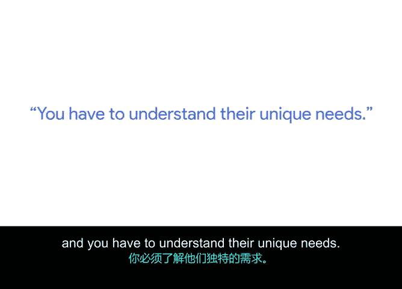

# 019：我的项目经理成长之路 🚀

在本节课中，我们将跟随谷歌高级项目经理雷切尔的分享，了解她如何从一名调酒师转型为项目经理，并探讨这段独特经历如何塑造了她的核心工作技能。她的故事揭示了项目管理中“人”与“关系”的重要性。

---

我的名字是雷切尔，我是谷歌纽约办公室的一名高级项目经理。

大约十二年前，谷歌从东村的一家酒吧雇佣了我。

当时，一群纽约运维和站点可靠性工程师常来我的酒吧喝酒。和所有酒吧客人一样，他们会向调酒师寻求建议。我为他们提供建议，帮助他们解决了许多问题，并和他们成为了朋友。我非常钦佩他们，他们极其聪明、富有魅力，并且酒量好、小费也给得大方。

最终，我希望自己的生活有所改变，不想再整晚站在吧台后面。当时恰好有一个机会，可以申请加入他们团队的行政岗位。

于是，我在2008年加入了谷歌。他们最初雇佣我担任纽约市站点可靠性工程与运维部门的行政人员。

大约两年后，我转岗进入了项目管理领域。

现在谷歌的招聘流程已经更加常规化。

但我在做调酒师时磨练的技能，至今仍影响着我的日常工作。

---

一位在下东区认识的睿智老调酒师曾告诉我，酒吧就是一个摆满桌椅、有些啤酒的房间，而会议室也一样。

一个摆满桌椅的房间。人们走进酒吧，就像走进会议室一样，都希望离开时能感受到一些变化。

因此，作为一名项目经理，我的工作就是帮助人们完成这种体验。

这种彼此会面、做出决策、共同得出结论的审美体验，与调酒并帮助人们度过一个更美好的夜晚非常相似。

我能成为一名项目经理，始于有人愿意在我身上冒险。

我的工程合作伙伴从行政人员中选中了我，因为他知道我能与他的工程师们建立良好的社群关系。

---

上一节我们了解了角色转换的契机，本节中我们来看看具体技能的迁移。以下是调酒师工作中培养的核心能力，它们如何直接应用于项目管理：

*   **沟通与理解需求**：当你在酒吧工作时，你必须与每一位走进酒吧的客人交谈。任何穿过那扇门的人都是你的顾客，你必须理解他们想要什么，想喝什么，是否还能继续喝，或者是否应该停止。当你与领域专家、工程师、产品设计师或用户体验人员合作时，同样的原则也适用。因此，你必须能够与团队中的任何工程师、任何你需要合作的产品经理交谈，并且理解他们独特的需求。

---

项目管理不仅仅是关于流程和你创建的交付物。

它关乎你如何与人建立联系，关乎你如何运用在人生其他阶段学到的经验，无论是在酒吧还是在艺术学院。这些你带入工作的经历，使你的工作独一无二。

你与人交谈、化解冲突或理解他人需求的技能，这些才是让你成为一名优秀项目经理的关键。

---

本节课中，我们一起学习了雷切尔从调酒师到项目经理的非传统职业路径。她的故事强调，**项目管理 = 技术流程 + 人际技能**。核心在于将过往人生经验（如调酒师工作中的沟通、观察、服务意识）转化为项目管理优势，真正理解并服务于团队中每一个独特的“人”，从而推动项目成功。