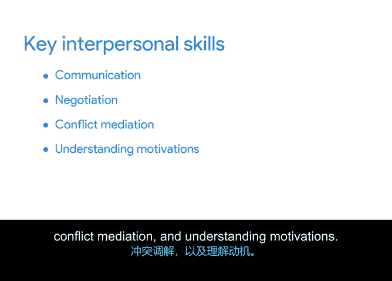

**谷歌项目管理专业证书：第1课：领导力与团队动态**

在本节课程中，我们将探讨项目经理如何运用人际交往技能来建立关系、领导团队，特别是在没有正式职权的情况下影响他人。这是项目管理中至关重要且富有挑战性的一环。

上一节我们介绍了项目经理在团队中的角色，本节中我们来看看如何运用具体的人际交往技能来有效领导团队。

运用人际交往技能是与项目团队成员及利益相关者建立关系的关键。通过发展这些关系，你将了解团队的需求和关切。这将帮助你确定项目的优先事项，并在整个过程中激励你的团队。

拥有强大的人际交往技能是优秀领导力的重要组成部分。即使你从未担任过正式的领导职位，掌握这些技能也能在你需要指导团队时提供帮助。

这被称为 **“无职权影响力”**，指的是项目经理在不作为团队成员直接上级的情况下，引导他们完成指定工作的能力。

即使没有作为团队伙伴上司的正式职权，你也可以运用几项关键的人际交往技能来实现这一点并引导项目成果。

以下是实现“无职权影响力”所需的四项核心人际交往技能：

*   **沟通**：在领导团队的背景下，沟通可以包括与团队成员沟通以了解任务进展，并就其工作质量提供清晰的反馈。
*   **谈判**：当团队成员告知无法按时完成工作时，谈判可能包括与其协作，就新的截止日期达成妥协。你需要经常运用谈判技巧来平衡团队成员、利益相关者的需求与项目的最佳利益。
*   **冲突调解**：项目计划可能变更，问题也会出现。这有时会导致团队内部的紧张和冲突。因此，练习和发展冲突调解技能至关重要，以确保项目不会因此受到影响。这可能涉及安排会议，帮助两位在如何处理共同任务上存在分歧的团队成员达成一致。
*   **理解动机**：这意味着了解你的团队成员，弄清楚是什么推动他们做出最好的工作。理解动机也包括了解团队成员更喜欢如何接收反馈，以及他们希望如何因出色工作而获得认可。你可以利用这些个性化的信息来激励和鼓励团队中的每个人。

总而言之，沟通、谈判、冲突调解和理解动机都是帮助你发挥“无职权影响力”的人际交往技能。

在项目管理职位的面试中，你可能会被要求讨论一次你发挥“无职权影响力”的经历。很可能你已经在自己生活中运用过这些技能，只是没有意识到。例如，假设你有一位同事每次开会都迟到。虽然你无法强迫他们准时到达，但你可能会思考如何激励他们想要准时。在这个过程中，你可能也考虑过如何改变与这位同事的沟通方式来影响他们准时。也许你曾尝试要求他们比其他人早到15分钟，或者告诉过他们这种行为如何影响团队的其他成员。这些策略都是“无职权影响力”的例子，旨在鼓励特定的行为。

“无职权影响力”是项目管理中最关键也最具挑战性的方面之一。正如你所了解的，你需要有效运用你的人际交往技能来实现它。

在后续课程中，我们将回顾并深入学习如何运用人际交往技能来管理各种项目。

本节课中我们一起学习了“无职权影响力”的概念及其依赖的四项核心人际交往技能：沟通、谈判、冲突调解和理解动机。掌握这些技能对于在没有正式职权的情况下有效领导团队至关重要。