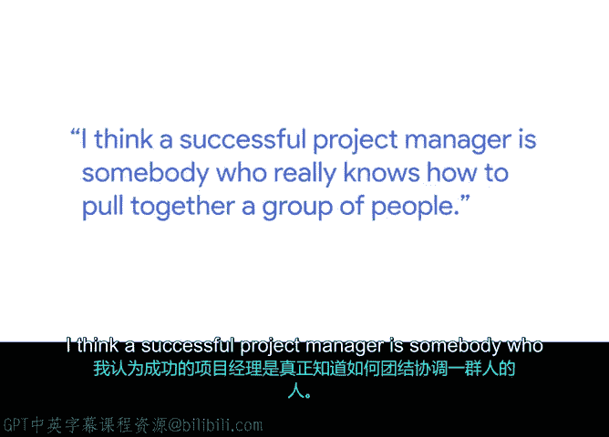
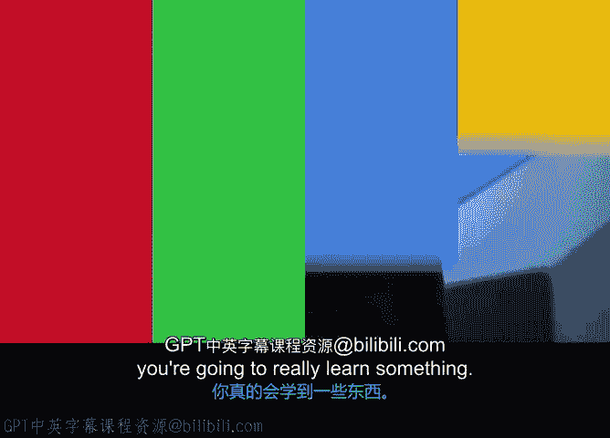

# 021：成功项目经理的特质 🎯

在本节课中，我们将跟随谷歌技术项目管理总监埃伦，探讨成功项目经理所具备的核心特质。我们将了解项目管理中“事”与“人”两个关键维度，并学习如何通过积累多样化经验来持续成长。

我是埃伦，是谷歌的技术项目管理总监。这意味着我领导着一个项目经理团队。我热爱项目管理，因为我深信团队协作的力量——将一群人组织起来，围绕一个共同目标协调一致，我们能完成远超个人能力的非凡之事。

我认为，成功的项目经理是真正懂得如何凝聚一群人的人。



在我看来，项目管理包含两个核心部分。一部分是**对目标执行的激光般专注**，另一部分则是**对人的关注**。因此，一位成功的项目经理需要同时做好这两方面。


---

## 从管理项目到培养项目经理

当我最初开始管理项目经理时，重点在于每个人负责自己的项目。我的角色是指导他们，为他们的项目提供建议和帮助。多年以来，我的重心已经从“指导项目管理”转向了“培养项目经理”。

这两者有所不同。我不再只是说“你的项目应该这样做”，而是真正致力于帮助他们**思考如何思考他们的项目**，即培养他们的战略性思维和问题解决能力。

---

## 构建多元化团队

在构建项目管理团队时，我经常思考的一点是，要拥有一群背景和经验**多元化**的成员。我们是一家全球性公司，因此也致力于打造一支真正的全球团队。

当我谈到背景和经验的多元化时，它涵盖了在不同类型的环境中工作、与不同类型的团队协作等各个方面。

---

## 持续成长之道

当我与新项目经理交流，他们询问“如何持续成长”时，我的回答是：**参与不同的项目**。尽可能多地接触不同的项目，不要害怕尝试不同的领域、不同的业务范畴，与不同的人合作。

**核心成长公式：**
```
成长 = 多样化项目经验 × 主动学习
```

因为每一个你参与的项目，都会让你学到新的东西。



---

## 总结


本节课我们一起学习了成功项目经理的特质。我们了解到，卓越的项目管理需要平衡**对事的专注执行**与**对人的关注协调**。职业发展的关键在于主动寻求**多元化的项目经验**，通过在不同领域、与不同团队协作来不断拓展自己的技能和视野。记住，每一次新的项目挑战都是一次宝贵的学习机会。