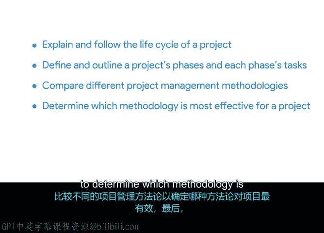

# 023：项目管理生命周期与方法论 🚀

在本节课中，我们将要学习项目管理中的两个核心框架：项目生命周期和项目管理方法论。我们将了解项目从开始到结束的各个阶段，并比较两种主流的方法论——瀑布模型和敏捷模型，帮助你理解如何根据项目特点选择合适的管理方式。

## 概述

上一节我们介绍了项目管理的定义、项目经理的角色与核心技能。本节中，我们将深入探讨项目管理的具体运作框架。

## 项目管理生命周期 🔄

项目管理生命周期描述了项目从启动到收尾所经历的完整过程。理解这个周期有助于系统化地规划和管理项目任务。

以下是项目管理生命周期的四个主要阶段：

*   **阶段一：启动**
    *   此阶段定义项目目标、范围和关键利益相关者。
*   **阶段二：规划**
    *   此阶段制定详细的路线图，包括任务、时间表、资源和预算。
*   **阶段三：执行**
    *   此阶段协调人员和资源以完成规划的任务。
*   **阶段四：收尾**
    *   此阶段交付项目成果，评估表现并总结经验教训。

## 项目管理方法论 ⚙️

项目管理方法论是为项目生命周期提供结构化指导的框架或系统。不同的方法论适用于不同类型的项目。

接下来，我们将介绍两种最流行的项目管理方法论。

### 瀑布模型

瀑布模型是一种线性、顺序性的方法。每个阶段必须在下一阶段开始前完全完成。其流程通常表示为：
`需求分析 → 系统设计 → 实施 → 测试 → 部署 → 维护`

### 敏捷模型

敏捷模型是一种迭代、增量的方法。项目被分解为一系列小的“冲刺”，在每个冲刺中完成一部分可交付成果，并允许根据反馈灵活调整。其核心循环是：
`规划 → 开发 → 测试 → 评审 → (基于反馈) 调整并进入下一循环`

## 如何选择合适的方法论 🤔

选择哪种方法论取决于项目的具体需求、复杂度和不确定性。

以下是影响方法论选择的一些关键因素：

*   **项目需求明确度**：需求明确、变化少的项目更适合瀑布模型；需求可能变化的项目更适合敏捷模型。
*   **项目复杂性与创新性**：复杂或需要创新的项目常从敏捷方法中受益。
*   **客户与利益相关者参与度**：需要客户持续参与和反馈的项目适合采用敏捷方法。
*   **时间与预算约束**：有严格、固定期限和预算的项目可能更倾向于瀑布模型。

## 总结

本节课中我们一起学习了项目管理生命周期及其四个阶段：启动、规划、执行与收尾。我们还探讨了两种核心的项目管理方法论——线性的瀑布模型和迭代的敏捷模型，并分析了如何根据项目特点选择最有效的方法。掌握这些框架是成功规划和引导项目的基础。