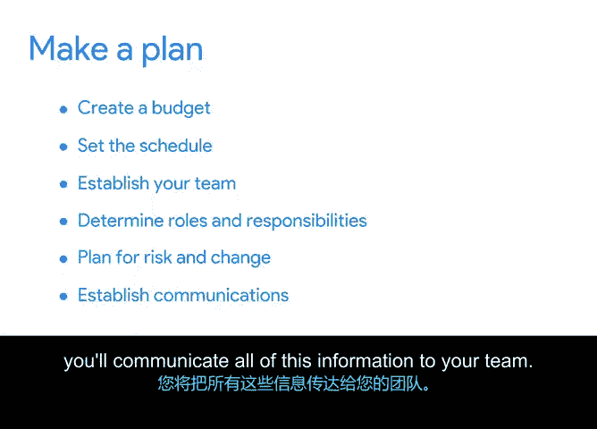

# 025：启动与规划

在本节课中，我们将要学习项目生命周期中与各阶段相匹配的具体任务。我们将重点探讨项目启动和规划这两个初始阶段的核心工作。

## 项目生命周期回顾 📋

在深入探讨具体任务之前，让我们先简要回顾一下项目生命周期的四个阶段：
1.  **启动项目**
2.  **制定计划**
3.  **执行并完成任务**
4.  **结束项目**

需要注意的是，不同项目类型或组织可能对这些阶段的命名或具体任务有细微调整。在谷歌，我们综合运用多种项目管理方法，这些方法将在后续课程中详细介绍。但无论采用何种方法，所有项目在完成过程中都包含许多共通的核心任务。

## 第一阶段：启动项目 🚀

上一节我们回顾了项目生命周期的整体框架，本节中我们来看看启动阶段的具体任务。项目生命周期的第一步是启动项目。在此阶段，你需要整理所有与项目相关的可用信息，为进入下一阶段的计划制定做好充分准备。

定义项目目标至关重要，它能使项目细节清晰化，从而确保你和团队能够成功完成项目。例如，如果项目目标是管理一场政治竞选，那么具体的可交付成果可能包括：筹集5000美元资金，或为支持候选人的事业征集到500个签名。

为了达成目标，你需要进行一些研究以构思方案，并确定可用的资源。资源可以包括人员、设备、软件、供应商、物理空间或地点等。任何实际完成项目所需的事物都被视为资源。

作为项目经理，你需要将所有细节记录在**项目提案**中，然后提交给公司的决策者或决策小组审批，以便推进项目计划。在某些情况下，你可能就是决策者，因此在进入下一阶段前，务必仔细考量相同的因素。

别担心，关于如何创建项目提案的所有细节，我们将在课程后续部分深入讲解。

## 第二阶段：制定计划 📝

一旦项目获得批准，你将进入项目生命周期的第二步：制定计划。在此阶段，你需要创建预算、设定项目时间表、组建项目团队，并确定每个成员的角色和职责。

你可能会想：为什么我们不能直接开始执行？这正是项目管理的关键所在——周密的规划对项目成功至关重要。项目管理的一个核心部分是**为风险和变更做计划**。经验丰富的项目经理深知，计划总是会变化的。😊

这种适应能力的关键在于提前思考和规划。进度延误、预算变更、技术与软件需求、法律问题、质量控制以及资源获取等，都是项目经理需要考虑的更常见的风险和变更类型。因此，请记住，规划是降低这些风险的关键。

如果目前“风险”这个概念让你感到有些不知所措，请不要担心。在后续课程中，我们将详细讲解如何理解风险。现在只需知道，**切勿跳过此步骤，务必制定计划**。重申一次，项目的成功取决于此。

## 沟通计划 📢

制定计划后，你需要将所有这些信息传达给你的团队。这样，每个成员都能明确自己负责的任务，以及在遇到问题或有疑问时该如何处理。

你还需要与对项目成功感兴趣的其他相关方沟通你的计划，以便他们了解你的计划和项目进展。

## 总结

本节课中我们一起学习了项目生命周期前两个阶段——启动与规划的核心任务。我们了解到，启动阶段的核心是**定义目标、梳理资源并形成项目提案**；而规划阶段则侧重于**制定预算、时间表、组建团队并为潜在风险做好准备**。周密的规划是项目成功的基石。

接下来，我们将探讨剩余的两个阶段：执行并完成任务，以及结束项目。稍后见。😊