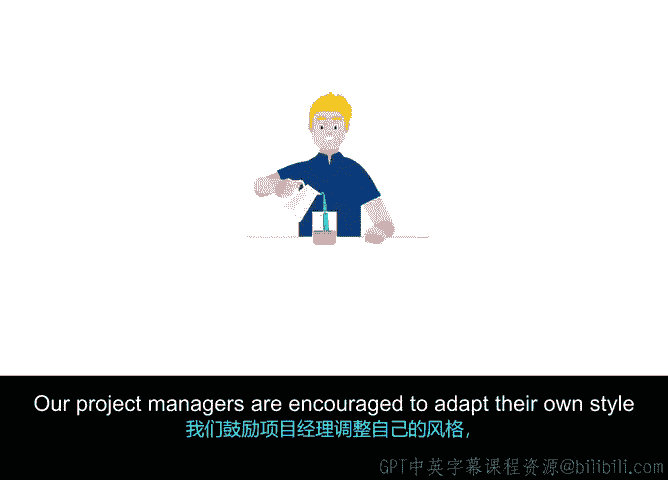

# 027：项目管理方法论介绍 🧩

在本节课中，我们将要学习项目管理方法论的基本概念，了解线性与迭代两种主要方法的特点，并探讨如何根据项目类型选择合适的方法。

## 概述

项目管理方法论是一套指导原则和流程，用于在整个项目生命周期中管理项目。它帮助项目经理通过一系列步骤、待完成任务和总体管理原则来指导项目。不同的项目类型适合应用不同的项目管理方法。

## 线性方法论

上一节我们介绍了方法论的基本概念，本节中我们来看看第一种类型：线性方法论。

线性意味着前一个阶段或任务必须在下一个开始之前完成。这种方法适用于目标明确、流程清晰、变更可能性低的项目。

**核心公式**：`任务N完成` → `任务N+1开始`

例如，建造房屋就是一个典型的线性项目。你需要先完成设计蓝图，才能开始打地基；必须完成地基，才能砌墙；必须完成墙体，才能安装屋顶，最终建成一座平房。项目目标非常明确，客户中途不太可能将平房改为多层维多利亚式建筑。即使他们想改变，也为时已晚，因为地基和墙体已经按照平房规格建造完成。

使用这种线性方法，按顺序完成每个步骤，坚持商定的具体成果，就能准确交付客户订购的产品。

## 迭代方法论

了解了顺序固定的线性方法后，我们再来看看更具灵活性的迭代方法论。

迭代方法采用更灵活的方式，其中一些阶段和任务会重叠或同时进行。这种方法适用于目标可能动态调整、需要持续反馈的项目。

**核心概念**：`任务并行` + `持续反馈` → `动态调整`

以电视公司制作新节目为例。团队提出节目创意并拍摄试播集，然后在不同地点和时段进行多次测试。在收集试播集反馈的同时，就可以对节目进行调整。与此同时，团队可以做出决策并开始项目的其他部分，例如聘请常驻演员、开始影片制作和进行广告宣传，甚至在节目最终版本确定之前就可以推进这些工作。

虽然总体目标（制作新节目）是明确的，但节目类型可能与最初设想不同。团队可能一开始计划制作一小时节目，但测试后发现半小时节目更受欢迎；或者某个配角获得大量积极反馈，因此想将其提升为主角之一。更重要的是制作出观众愿意观看的节目。

由于采用了迭代方法，计划保持灵活，团队能够在项目进行过程中随时调整。

## 方法对比与应用

以下是两种方法论核心特点的总结：

*   **线性项目**：开发过程中不需要太多变更，流程清晰且顺序固定。如果坚持计划，很可能在时间表和其他所有标准内完成任务。
*   **迭代项目**：允许更大的灵活性并预期变更。你可以在最终结果交付前测试项目的各个部分以确保其可行，并且可以在部分完成后就交付该部分，而无需等待整个项目完成。

多年来，项目管理领域发展出许多不同的方法，项目经理可以根据项目特点选择最有效的方式进行管理。谷歌采用混合项目管理方法，根据项目类型从不同方法中混合搭配。我们鼓励项目经理调整自己的风格，以适应其项目和团队的具体情况。

## 总结

本节课中我们一起学习了项目管理中的两种核心方法论：线性与迭代。你开始理解不同的方法如何使你将从事的项目受益了吗？很快，你将成为根据项目特点选择或组合方法的专家。

接下来，我们将学习最著名、最常用的项目管理方法，你可以将它们添加到你的项目管理工具箱中。