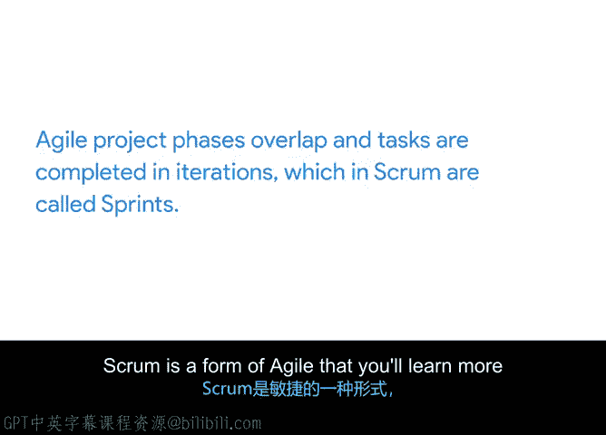

# 028：瀑布与敏捷方法概述 🏞️⚡

在本节课中，我们将要学习项目管理中两种最流行的方法论：瀑布方法和敏捷方法。我们将了解它们的基本概念、历史背景、核心特点以及各自适用的项目类型。掌握这些知识将帮助你为未来的项目选择合适的管理框架。

---

## 瀑布方法概述

上一节我们介绍了项目管理的生命周期，本节中我们来看看第一种具体的方法论：瀑布方法。

瀑布方法作为一种方法论诞生于20世纪70年代，其名称源于其**顺序排列的阶段**。项目像瀑布一样，从山顶流到山底，**依次完成每一个阶段**。

还记得上一个视频中关于线性的定义和例子吗？瀑布方法正是一种**线性方法**。最初，瀑布方法应用于制造业和建筑业等实体工程领域。后来，软件工程成为一个重要领域，瀑布方法也被应用于这类项目。至今，它仍在工程领域被广泛使用，包括产品功能设计和应用程序（App）设计。

随着时间的推移，活动策划和零售等其他行业也调整了瀑布方法的阶段以适应其项目。现在存在许多不同风格的瀑布方法，每种风格都有其特定的步骤。但它们都有一个共同点：**遵循一系列有序的步骤，这些步骤与明确定义、不太可能变更的期望、资源和目标直接关联**。

让我们更仔细地观察一下。瀑布项目的生命周期阶段遵循你之前学到的标准项目生命周期流程：**启动、规划、执行（包括管理和完成任务）以及收尾**。

那么，何时应该使用瀑布方法进行项目管理呢？以下是适用的情况：
*   当项目的各个阶段被明确定义时。
*   当某些任务必须在其他任务开始前完成时。
*   当项目启动后，实施变更的成本非常高时。

例如，如果你正在为一个预算非常紧张的客户承办一场活动的餐饮服务，你可能希望使用瀑布方法。以下是具体步骤：
1.  首先确认宾客人数。
2.  然后非常清晰地定义菜单。
3.  获得客户对菜单项目和成本的批准与同意。
4.  订购不可退货的食材。
5.  成功地为宾客提供餐饮。

由于预算有限，你无法承担变更或浪费食物的成本。这种传统方法不允许客户在下单后更改菜单。你也可以预订桌子、椅子和餐具，因为你确切知道正在准备食物的数量和种类。

一个经过深思熟虑的传统项目管理方法可以帮助你在项目执行过程中以尽可能少的麻烦达到预期结果。通过在项目前期投入额外精力进行通盘考虑，你将为自己奠定成功的基础。

在理想情况下，遵循这种方法将帮助你确定合适的人员和任务，进行相应规划以避免过程中的任何障碍，为记录进展中的计划留出空间，并最终实现目标。然而，计划并不总是，嗯，按计划进行。事实上，它们很少能完全按计划进行。瀑布方法包含一些风险管理实践，以帮助避免和处理项目变更。

---

## 敏捷方法概述

幸运的是，还有其他完全为变更和灵活性而构建的方法论。其中之一就是**敏捷**，这是另一种流行的项目管理方法。

“敏捷”一词意味着能够**快速、轻松地移动**。它也指**灵活性**，即愿意并能够改变和适应。采用敏捷方法的项目通常有许多任务同时进行或处于不同的完成阶段，这使其成为一种**迭代式方法**。

塑造敏捷方法论的概念在20世纪90年代开始出现，以应对当时对更快交付产品（主要是软件应用程序）日益增长的需求。但直到2001年，它才被正式命名为“敏捷”。

敏捷项目的阶段也遵循我们之前描述的项目生命周期阶段。然而，与必须始终按顺序进行或等待一个阶段结束才能开始下一个阶段不同，**敏捷项目阶段是重叠的**，任务以迭代方式完成，在Scrum中这些迭代被称为**冲刺**。Scrum是敏捷的一种形式，你将在专门讲解敏捷的课程中了解更多。这里的“冲刺”并非指尽可能快地赛跑。

在这种情况下，**冲刺是指短的时间块，通常为一到四周，团队在此期间共同专注于完成特定任务**。

重要的是要理解，敏捷与其说是一系列步骤或阶段，不如说是一种**思维方式**。它关注于建立一个有效的协作团队，该团队定期寻求客户反馈，以便能够尽快交付最佳价值，并在变更出现时进行调整。

最适合采用敏捷方法的项目是那些客户知道自己想要什么，但没有具体的构想，或者他们对最终结果有一组期望的品质，但不太关心其具体外观的项目。另一个表明项目可能受益于敏捷的指标是项目涉及的高度不确定性和风险水平。我们将在后面更多地讨论这些内容。

一个适合采用敏捷方法的项目例子可能是构建一个网站。你的团队将以冲刺的形式构建网站的不同部分，并在每个部分构建完成后交付给客户。这样，网站可以随着某些部分（例如，主要的首页）的完成并准备好公开浏览而先行上线，而其他部分（例如，公司博客或在线预约功能）则随着时间的推移继续构建。这允许团队尽早获得关于哪些部分有效、哪些无效的反馈，并在过程中进行调整，减少浪费的精力。

在同样的网站例子中，瀑布方法则会计划并要求整个网站在上线前必须全部完成。

---

## 总结与展望

对瀑布和敏捷有一个基本的了解将帮助你找到一种有效的方式来组织和规划你的项目。了解这两种方法论在未来的工作面试中也会派上用场，因为你将能够展示对项目管理领域的扎实理解。

瀑布和敏捷是两种更常见和知名的项目管理方法论，但它们绝不是唯一或最好的方法。在接下来的视频中，你将了解精益和六西格玛，这是处理项目的另一种方式。在谷歌，信不信由你，我们会从这些方法论中为项目管理进行选择。