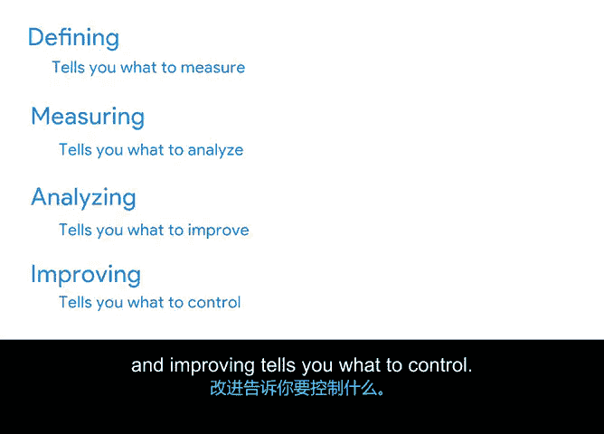

# 029：精益与六西格玛介绍 🎯

在本节课中，我们将要学习一种结合了精益和六西格玛两大方法论的项目管理方法——精益六西格玛。我们将重点了解其核心的DMAIC流程，并探讨它如何帮助团队通过数据驱动的方式，解决复杂问题、提升质量并优化流程。

---

## 精益六西格玛概述

现在，你的项目经理工具箱里已经有了瀑布式和敏捷式方法论。精益六西格玛是你可以添加的另一个工具。它是精益和六西格玛两种母方法论的结合。

精益六西格玛通常用于那些旨在**节省成本、提升质量并快速推进流程**的项目。它也注重团队协作，这有助于营造积极的工作环境。其核心理念是，当你的团队感到被重视时，积极性和生产力会提高，整个流程也会运行得更顺畅。

---

## DMAIC：精益六西格玛的五阶段流程

精益六西格玛方法包含五个阶段，它们分别是：**定义、测量、分析、改进、控制**，通常被称为 **DMAIC**。

DMAIC 是一个用于流程改进的策略，意味着你需要找出当前流程中的问题并加以解决，从而使一切运行得更顺畅。每个步骤的目标都是确保为你的项目取得最佳可能结果。

与瀑布式和敏捷式一样，使用DMAIC和精益六西格玛方法有更具体的细节。但DMAIC流程的一大优点是，它可以用来解决任何业务问题。

让我们来详细分解一下。

---

### 第一阶段：定义

第一阶段是**定义项目目标以及实现目标所需的条件**。这个阶段与传统项目管理的启动阶段非常相似。

让我们用一个真实场景来说明：想象一下，你被一家大型旅游公司聘为项目经理，负责帮助精简和减少因近期促销活动而激增的客户服务等待时间。

在开始着手解决问题之前，你需要定义项目目标，并与相关方讨论对项目的期望。在这个案例中，目标是将平均等待时间从30分钟减少到平均少于10分钟。

---

### 第二阶段：测量

接下来，是时候**测量当前流程的表现**了。为了改进流程，DMAIC 专注于数据。在此阶段，你需要绘制出当前流程，准确定位问题所在，以及这些问题对流程产生了何种影响。

使用我们的例子，你试图找出为什么这家旅游公司处理客户服务问题需要这么长时间。为此，你需要查看公司数据，如平均等待时间、每日客户数量和季节性变化等。然后，你需要制定一个计划，说明如何获取这些数据以及测量的频率。

这可能类似于让公司每周、每月或每季度生成报告。在其他情况下，你可能需要让员工或客户填写调查问卷，或者查看库存、运输和跟踪记录等。

一旦你拥有了数据和测量结果，就可以进入下一阶段。

---

### 第三阶段：分析

在这里，你将开始**识别差距和问题**。在我们的例子中，在绘制出流程和数据点后，你可能会发现，在客户量最高的日子里，人员配备不足。

数据分析对于项目经理来说至关重要，无论你选择哪种方法，我们将在后续课程中了解更多相关内容。根据你的数据，你将深刻理解问题的原因和解决方案，从而进入下一阶段。

---

### 第四阶段：改进

很多时候，项目经理可能想直接跳到这个阶段，但实际上，项目和流程的改进只应在仔细分析之后进行。这是你展示发现并准备开始进行改进的时刻。

在我们的例子中，这可能是调整人员配置以满足客户需求。

---

### 第五阶段：控制

这个循环的最后一步是**控制**。你已经将流程和项目调整到了一个良好的状态，现在是时候实施并保持这种状态了。

控制就是学习你前期所做的工作，以建立新的流程和文档，并持续监控，确保公司不会倒退到低效的旧工作方式。

总而言之，你可以这样记住DMAIC：
*   **定义**告诉你需要**测量**什么。
*   **测量**告诉你需要**分析**什么。
*   **分析**告诉你需要**改进**什么。
*   **改进**告诉你需要**控制**什么。

---

## 精益六西格玛与DMAIC的适用场景

当项目目标包括改进当前流程以解决复杂或高风险问题时，精益六西格玛和DMAIC方法是理想的选择，例如**提高销售转化率或消除瓶颈**（即流程中事物堆积的情况）。

遵循DMAIC流程可以降低跳过重要步骤的可能性，并增加项目成功的机会。同时，它也是你的团队发现最佳实践的一种方式，供客户未来使用。

它利用数据，关注客户或最终用户，以一种建立在先前学习基础上的方式来解决问题，从而为难题找到有效、持久的解决方案。

---

## 方法论的灵活应用

项目管理领域有许多方法将流程分解为易于理解的阶段和步骤，它们都拥有相同的最终目标：尽可能顺利地实现预期成果，并交付最佳价值。

正如我之前所说，在谷歌，我们遵循许多不同的方法。例如：
*   一个发布面向客户产品的工程团队，在创建产品时可能主要使用敏捷方法，但决定在规划和文档方面融入一些瀑布式项目管理的元素。
*   一个客户服务团队可能专注于使用精益六西格玛来改善用户体验，例如根据最近的分析提供新功能，但团队可能会使用敏捷迭代和冲刺来开发部分代码并推出功能，以便适应变化。
*   我们的内部教育和培训团队之一，可能完全专注于瀑布式项目管理，以实现让所有员工完成年度合规培训的特定目标。在这里，瀑布式是合理的，因为培训计划的要求是固定的，截止日期和目标也是固定的。

---

## 总结

本节课中，我们一起学习了精益六西格玛方法论及其核心的DMAIC流程。最大的收获是了解各种方法和工具，以便能够自信地应用最适合你、你的团队和最终目标的方法。

并没有一个完美的处方来告诉你如何完美地执行一个项目，因为总有一些因素是你无法100%控制的。但好消息是，通过学习这些不同的框架所培养的技能，你可以非常接近完美。