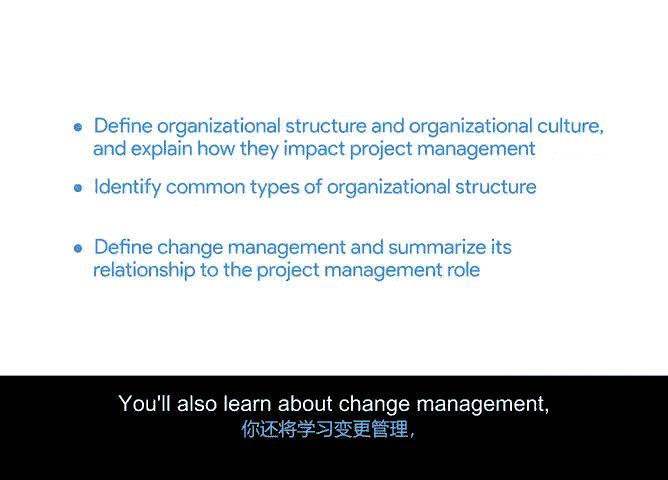

# 031：组织结构与文化

在本节课中，我们将要学习组织结构、企业文化以及变革管理。这些因素对于项目的设立、执行以及最终成果能否被组织采纳并持续应用至关重要。

到目前为止，课程已接近尾声。此前，我们探讨了项目的生命周期、阶段任务分解，以及项目经理可以使用的不同方法论，这些都有助于确保项目成功。我的同事们也分享了谷歌内部管理项目的一些方法。

本节中，我们来看看组织结构与文化，以及它们如何影响你设立和执行项目的方式。我将描述你在项目管理职业生涯中可能遇到的一些常见组织结构类型。你还会学习变革管理，它指的是你如何向组织呈现最终项目成果，并促使他们接受和实施你的项目成果。

这些是确保你的项目被采纳并持续下去的重要元素。

让我们开始学习这些概念。