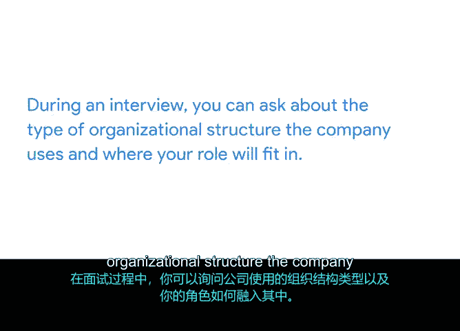

# 032：经典与矩阵结构概述

## 📋 课程概述
在本节课程中，我们将学习**组织结构**的概念，以及项目经理在不同结构中的角色。理解组织结构是确定你在团队中的位置、明确沟通对象和频率的关键。

## 🏢 什么是组织结构？
组织结构指的是一个公司或组织的排列或构建方式。它说明了工作任务如何被划分和协调，以及组织内所有不同成员之间如何相互关联。简而言之，组织结构让你了解**谁向谁汇报**。

然而，组织结构的意义远不止于此。理解不同类型的组织结构，就像拥有一张地图，它能帮助你确定自己的定位、明确应与谁沟通以及沟通的频率。

## 📊 组织结构的类型
既然我们已经对组织结构有了基本了解，接下来让我们看看在工作中可能遇到的各种组织层级。组织结构通常使用**汇报图**或**组织架构图**来描绘。

汇报图展示了组织内人员与团队之间的关系，并详细说明了每个人或团队向谁汇报。组织结构有多种类型，但在本课程中，我们将重点介绍两种较为常见的类型：**经典结构**和**矩阵结构**。

### 经典结构
经典结构遵循典型的指挥链。在这种结构中，首席执行官和其他高管位于顶层，其次是总监或经理，然后是他们的直接下属，依此类推。这些总监或经理通常负责监督组织内其职能领域的团队，例如市场营销、销售或人力资源。

你可以通过观察军队的一个分支来了解这种结构。以陆军为例，你可能以列兵身份入伍，向负责监督你所在班中多个人员的军士长汇报，而该军士长最终向中尉汇报，以此类推。

如果你的组织采用这种结构，作为项目经理，你可能会定期与你的经理以及从事同类项目的同事沟通。

### 矩阵结构
但组织结构并非总是简单的自上而下模式。还有其他因素使得组织结构比纸面上看到的更为复杂。例如，你可能拥有跨不同职能部门的项目团队。这在许多公司（包括谷歌）中很常见，通常被称为**矩阵结构**。

你可以将矩阵结构想象成一个网格。在这个网格中，你仍然有上级领导，但同时也有来自相邻部门的人员，他们期望了解你的工作进展。这些人可能不是你的直属上司，但由于他们可能会影响你工作的变更，你有责任与他们沟通。

以下是矩阵结构的两个例子：
*   **谷歌产品项目**：例如谷歌搜索项目，项目团队由项目经理、工程师、用户体验设计师等组成，每个团队成员都向各自的管理链汇报。
*   **跨团队合作**：例如在“全球事务”部门，员工有负责其核心工作的直属经理，但同时也会因项目需要，与非直属的项目负责人合作，并向其汇报进展、寻求批准和反馈。

## 🔄 结构回顾与影响
总结一下，**经典结构**遵循传统的自上而下汇报系统，而**矩阵结构**既有需要汇报的直属上级，也有来自其他部门或项目的利益相关者。

了解你所在的组织结构类型，对于你如何准备和执行项目，甚至在面试中，都起着重要作用。在面试时，你可以询问公司采用的组织结构类型以及你的角色将如何融入其中。这将有助于你和面试官清晰地沟通你日常需要接触的人员以及该角色的期望。

## 📝 本节总结
在本节课程中，我们一起学习了组织结构的定义，并重点探讨了**经典结构**和**矩阵结构**这两种常见类型。理解这些结构是项目经理有效沟通和履行职责的基础。

在下一课程中，你将听到一位谷歌员工介绍第三种结构类型——**项目管理办公室**，这种结构在你工作或面试的一些组织中也可能遇到。