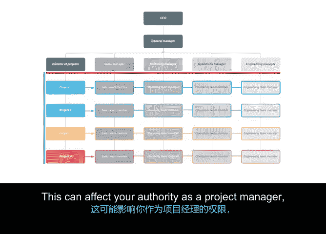

# 033：组织结构如何影响项目管理 🏢

在本节课中，我们将要学习组织结构如何对项目管理产生深远影响。理解你所在的组织结构，对于如何准备和执行项目至关重要。

上一节我们介绍了项目管理的核心概念，本节中我们来看看组织结构如何为项目提供责任与沟通的框架。作为项目经理，了解你的汇报对象以及团队成员的汇报对象至关重要。同时，组织结构也决定了你如何获取项目所需的资源，以确保项目高效完成。

## 组织结构的影响方式

组织结构主要通过以下两种方式影响项目管理：

### 项目经理的职权

**职权**关系到你为项目做出影响组织决策的能力。你的职权和责任水平会因项目而异。

以下是职权可能的表现形式：
*   在某些情况下，你可能有权选择为项目提供服务的供应商。
*   在其他情况下，可能有一组预先为你选定的供应商。

### 资源的可用性

了解如何获取所需的人员、设备和预算，会使项目管理变得容易得多。

## 不同组织结构下的项目管理

让我们探讨不同结构如何影响你的项目管理方式。

### 经典组织结构

在经典结构中，你可能拥有较少的职权和更严格的约束。为了推进和完成特定任务，你可能需要依赖获得相应经理、总监和部门负责人的批准。在这种情况下，这些人很可能负责管理你的团队成员和你所需的资源。

作为经典结构中的项目经理，你可能需要依赖组织内的经理来批准资源。换句话说，参与你项目的人员数量或分配给项目的预算，由你的部门或职能领导决定。

以下是经典结构中的资源获取流程：
*   你可能需要经过一系列审批流程。
*   如果你需要更多资源，必须为此进行争取。例如，如果需要增加预算，你需要向你的经理报告。
*   然后，你的经理可能会将此问题上报给他们的管理层链以获得批准。

这就是经典结构，一种传统的自上而下的员工与职权安排。

### 矩阵组织结构

现在，让我们探索矩阵结构。矩阵结构与经典结构的主要区别在于，员工通常有两个或更多的经理或领导需要协作和汇报。

你的团队成员将有其职能经理和你（项目经理）。如果成员同时参与多个项目，他们甚至可能有更多的经理。这会影响到你作为项目经理的职权，因为你需要与组织内不止一位领导合作。

以下是矩阵结构中的关键注意事项：
*   你可能需要共享资源并协商优先级。
*   关键在于确保你知道利益相关者是谁，以及谁控制着什么，因为指挥链并不总是像经典结构中那样清晰。
*   由于矩阵结构中并不总是存在清晰的指挥链，你需要在项目开始前，就明确识别并沟通所有你可能需要汇报和获取批准的对象。

一旦这些关系确立，矩阵结构内的项目应该能够高效运行。矩阵结构强调团队和组织的强项目导向，因此你作为项目经理，通常拥有更多的自主权来根据需要做出决策和收集资源。

## 总结

本节课中我们一起学习了组织结构对项目管理的重大影响。正如我们所看到的，组织的构建方式会对项目的规划与执行产生巨大影响。理解这一切将帮助你更高效地运行和管理项目。

接下来，我将介绍组织文化，这是影响你管理项目的另一个重要因素。稍后见。