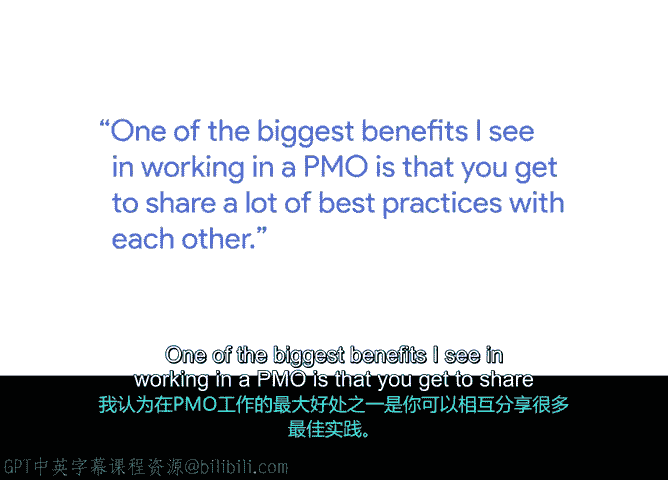
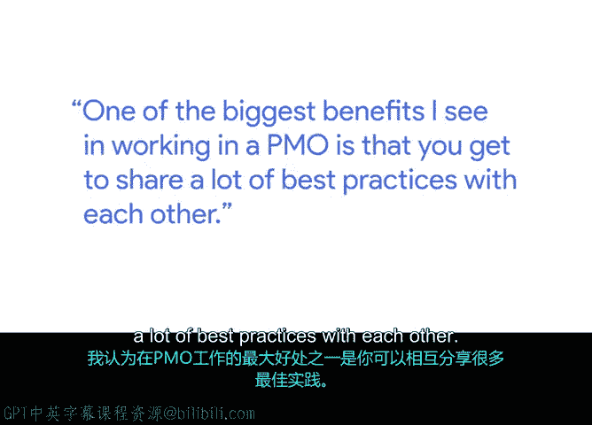

# 034：在项目管理办公室工作 🏢

在本节课中，我们将跟随谷歌的项目管理总监兰，了解在项目管理办公室工作的具体职责、职业发展路径以及其中的优势与挑战。

## 概述

项目管理办公室是一个由项目经理组成的团队。我们的核心职责是协调项目的各个不同部分，包括产品团队、工程团队以及众多业务职能部门，共同将想法变为现实。

## 项目管理办公室的职责

上一节我们了解了PMO的基本定义，本节中我们来看看其具体工作内容。

我的具体角色是确保项目相关的所有不同部分能够连接在一起，形成一个整体。有时我们会发现，一个项目可能分散在不同地方进行，甚至彼此之间互不知情。项目经理最关键的任务之一，就是获得项目的全局视野。

因此，我和我的团队主要致力于确保所有需要连接的环节真正地连接起来。

## 职业发展路径

从专注于项目的一部分，到负责完整的端到端项目，再到管理大型复杂项目，每个阶段都带来了不同的视角和收获。

以下是不同职业阶段的特点：

*   **早期阶段**：负责项目的某个部分。这使我有机会深入某些技术领域，并与合作的团队建立深厚且有意义的联系。
*   **成长阶段**：负责完整的端到端项目。这些项目规模相对较小，是积累全面管理经验的好机会。
*   **成熟阶段**：负责大型复杂项目。在这个阶段，可以看到大型生态系统中所有不同的环节如何协同运作。这需要长时间的积累。

在每一个阶段，我都在持续学习，学习如何更广泛地协作，以及如何以不同的方式思考，但核心始终是确保项目的执行力和严谨性，让想法得以实现。

## 在PMO工作的优势与挑战

在PMO工作的一大好处是能够与同行分享最佳实践。项目经理的一个常见挑战是通常需要与大量客户团队和其他职能部门的同事合作，反而较少与其他项目经理协作。

而在PMO中，你可以与其他项目经理建立联系。以下是这种联系带来的具体好处：

*   **分享挑战与经验**：你可以分享遇到的挑战，并了解他人是如何克服的。
*   **共享模板与工具**：你可以分享自己花时间开发的模板或工具，或者直接使用他人已经准备好的现成资源。公式可以表示为：`可用资源 = 自有资源 + 共享资源`。
*   **建立专业社区**：最重要的是，你拥有一个思考方式相似的社区。这个社区的成员通常以**系统化、任务导向、行动导向和目标导向**的方式解决问题，这与长期跨职能协作的环境有所不同。

## 总结

本节课中，我们一起学习了项目管理办公室的核心职能，即协调与整合。我们探讨了项目经理从负责局部到掌控全局的职业发展路径，并分析了在PMO工作中，通过社区共享最佳实践、工具和应对挑战的经验所带来的独特优势。理解这些内容，有助于你认识项目管理工作的多样性和协作价值。