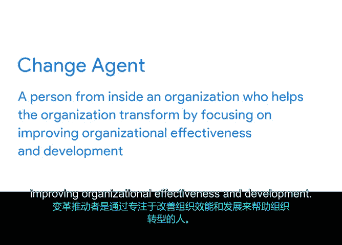

# 035：组织文化介绍 🏢

在本节课中，我们将要学习组织文化的概念及其对项目管理的影响。理解组织文化能帮助你更有效地领导团队、规划项目，并确保项目获得必要的支持。

---

组织文化是什么？我们可以从两个简单的问题开始：你对文化了解多少？你如何定义文化？

当听到“文化”这个词时，首先想到的可能是语言、食物、服饰等。但需要注意的是，文化还包括一些不那么明显但同样具有影响力的部分，例如**信念、传统和习俗**。了解一个人的文化，能让我们更深入地洞察他是谁以及他如何与世界互动。

这对组织也同样适用。一个组织的文化提供了背景，并作为其成员**重视什么、日常如何运作、如何相互联系以及预期如何表现**的指南。

定义组织文化的方式有很多。有些定义强调团队合作与创新，而另一些则关注细节和成就。许多论文、研讨会和会议都致力于定义和分析组织文化。我们时间有限，所以我会尽力总结。

组织文化，部分是员工共享的价值观，也是组织的**价值观、使命、历史**等。换句话说，组织文化可以被看作是公司的“个性”。

理解组织文化将帮助你更有效地引导团队实现项目目标。它也会影响你规划项目的方式。你需要熟悉组织文化，以便**最小化冲突**，并尽可能在支持和和谐的氛围中完成项目。

---

上一节我们介绍了组织文化的定义，本节中我们来看看如何识别和利用组织文化。

组织的使命和价值观可以为其文化提供线索。如果你能证明项目如何支持公司使命或如何与公司价值观保持一致，你将更容易从高管和利益相关者那里获得所需的**批准和资源**。

请注意组织领导者在开展业务时重视什么。管理团队是更关心速度还是完美？组织内部的人如何做决策？他们会彻底审视每个决策的每个选项吗？这将帮助你了解对他们而言最重要的价值观，以及你应如何做出决策。

如果你在项目中遇到困难，需要关于某个决策的指导，或者不确定如何与组织中的人沟通，回顾使命和价值观可能会指引你找到正确的处理方式。

以下是一个例子：
*   如果公司重视**稳定性和用户反馈**，它可能会鼓励延长项目时间线以进行测试，然后根据测试结果做出决策。
*   如果公司重视**创新和收入增长**，它可能会鼓励缩短时间线以更快推出产品，并愿意承担风险尝试新想法。

作为项目经理，当你理解了不同类型的价值观以及优先事项时，你就会知道如何更好地为组织内的对话做准备。

理想情况下，你最好在项目第一阶段开始前就对组织文化有良好的了解。如果你正在面试一个项目管理职位，询问公司文化是获取更多信息的好方法。这也向面试官表明，你了解文化对项目的影响。

---

为了帮助你更好地了解组织文化，请考虑以下问题：

*   **沟通偏好**：人们更喜欢如何沟通？主要是通过预定会议、电子邮件还是电话？
*   **决策方式**：决策是如何做出的？是多数投票还是自上而下的批准？
*   **入职仪式**：当有新员工入职时，有什么惯例？是带出去吃午餐、参观大楼还是向员工介绍？
*   **项目管理风格**：项目通常如何运行？他们偏好经典模式、矩阵模式还是其他项目管理风格？
*   **实践与价值观**：组织中的人体现了哪些实践、最佳方式和价值观？加班或周末工作是常态吗？有公司组织的社交活动吗？

了解公司重视什么会告诉你很多关于其文化的信息，以及在你推进项目时如何处理沟通、管理期望和识别潜在冲突。

---

一旦你开始进行项目，以下是一些驾驭公司文化的方法，它们将帮助你最大限度地发挥团队作用，并确保项目获得支持。

正如刚才讨论的，**确保多提问**。在观察文化时，试着问问同事他们认为哪些方面做得好，哪些方面需要改变。你的同事可能和你有相同的看法。如果没有，你可能会学到在面试过程中没有学到的新东西。无论哪种方式，你都能更好地评估风险、调整当前项目或为未来的项目做更充分的准备。

**进行观察**也是一个好主意。了解事情如何运作以及人们喜欢和尊重公司文化的哪些方面很重要。在不同地区工作时，了解既定的习俗也很重要，例如鞠躬、握手或佩戴头巾。这将帮助你获得理解并建立尊重的关系。

最后，**理解你的影响**很重要。要意识到你作为“变革推动者”的角色。**变革推动者**是指通过专注于提高组织效能和发展来帮助组织转型的人。

你和你的项目很可能以某种方式影响组织。有时，仅仅是项目经理的存在就会改变办公室环境或员工动态。如果你的项目需要组织必须适应的重大变革，请注意这些变革可能有多极端，并尽早寻求反馈和批准。公司可能不同意某些似乎不符合其使命、愿景或文化的变革。认识到可实施变革的**限制或边界**，并理解什么对项目和公司整体最有益，这一点很重要。

---

正如你所见，组织文化对项目决策的制定方式有很强的影响力。组织的结构方式通常会影响存在的文化类型，因此在规划和执行项目时，同时考虑结构和文化非常重要。

接下来，我们将讨论你的项目如何在工作场所创造变革，以及如何让利益相关者和员工支持并实施你的项目。

---

本节课中我们一起学习了组织文化的核心概念、如何识别和利用它来支持项目管理，以及项目经理作为变革推动者的角色。理解这些是成功驾驭项目环境的关键。