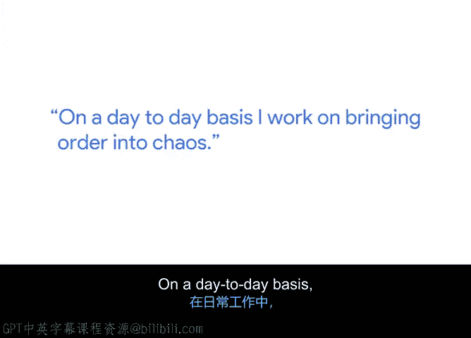
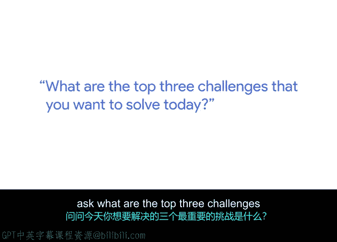

# 036：生活与组织中的项目管理 🧩

在本节课中，我们将跟随谷歌高级工程项目经理阿马尔的分享，了解项目管理如何作为一种思维方式，不仅应用于软件项目，也贯穿于我们的日常生活与各类组织运作中。我们将学习如何识别并管理“混乱”，以及如何通过聚焦关键挑战和定义成功来提升效率。

---

大家好，我是阿马尔。我是谷歌购物部门的一名高级工程项目经理。

在日常工作中，我负责推动谷歌内部跨多个产品的项目。

在我看来，项目管理更像是一种生活方式。生活中的一切都是项目，无论是养育孩子、建造房屋、购买汽车，还是我们做的任何事。

我们所做的任何事情都有一个开始和结束的过程。在我们所做的所有事情中，无论是决策、预算还是其他方面，系统内部都存在大量的摩擦和混乱。这一点同样适用于软件项目管理，甚至建筑行业。

从启动一个建筑项目到真正安置好床铺等所有物品，整个过程从某些角度来看充满了混乱。例如，是否联系了正确的人？会议中是否有正确的决策者？我们是否及时获得了足够数量的批准？

在我的职业生涯中，无论是在之前的公司还是在谷歌，我都目睹了许多效率低下的情况。这些情况在开发周期后期极大地增加或暴露了风险。

这就是我所看到的混乱世界。我深感自己可以在解决这些日常混乱中发挥作用。我的日常工作就是将秩序带入混乱之中。

在软件项目开发的世界里充满了混乱。而我们作为项目经理，要确保将这些混乱整合起来，使其有序。

当我开始我的项目管理之旅时，我主要寻找的东西之一，要感谢我的导师们。我非常珍视我的导师。

他们教会我的一件事是：阿马尔，当你每天来工作时，问问自己今天想要解决的三大挑战是什么。

直到今天，我仍然遵循这个方法。我总是思考今天要解决的最重要的三件事是什么，那些重大的、有影响力的事情。

同时，我也会帮助我的团队在每周理解“成功”是什么样子。每周一早上，我会与战略人员进行会议，进行非常战略性的讨论，探讨本周的成功是怎样的，我们如何定义这一周是成功的。

这就是我开启一周工作的方式。这在项目交付或生活中创造了奇迹。我非常喜欢这些方面。

---

本节课中，我们一起学习了项目管理思维在生活与工作中的普适性。我们认识到，从日常事务到大型软件项目，普遍存在“混乱”。作为项目经理的核心职责是 **`将秩序带入混乱`** 。关键实践包括：每日聚焦 **`三大关键挑战`** ，以及每周初与团队明确 **`成功的定义`** 。这些方法能有效提升个人与组织的效率与成果。