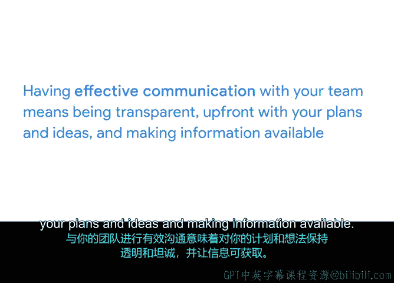

# 037：变革管理介绍 🚀

在本节课中，我们将要学习项目管理中的一个关键环节：变革管理。我们将探讨如何确保项目成果被组织顺利采纳，以及项目经理在这一过程中的角色。

## 概述

上一节我们介绍了组织结构和文化对项目的影响，本节中我们来看看如何将项目成果成功交付并推动组织采纳。这个过程被称为变革管理。理解变革管理能确保项目不仅成功完成，而且其建议能被组织接受和采用。例如，为员工推出新的时间追踪系统时，如果员工不采用新系统，项目就不算成功。

## 变革管理的核心概念

变革管理涉及组织内人员因工作场所变化而受到直接影响。实施新项目可能意味着流程、预算、时间表以及员工角色和责任的改变。即使是看似简单的变化，如更换公司标识，也可能给员工带来调整的挑战。

考虑到项目的成功，必须牢记人们因此需要实施的改变。思考这些变化将帮助你成功获得项目的接受和采纳。

## 变革管理的三大核心实践

尽管存在许多变革管理模型，但它们都共享以下三个核心概念和最佳实践。

以下是变革管理的三个核心实践：

1.  **建立所有权和紧迫感**
    *   **所有权**：让他人感到被授权，能为其任务的成功完成负责。
    *   **紧迫感**：让他们理解项目的重要性，并明确需要采取哪些行动来推动项目前进。
    *   当团队成员对项目拥有所有权和紧迫感时，会提升他们对项目成果的兴趣、动力和参与度。

2.  **组建互补的团队**
    *   在选择团队成员时，要找到知识和技能互补的人。
    *   如果团队是预先指定的，尝试争取分配任务的权利。如果不行，则需格外努力与团队建立联系，让他们对项目感到兴奋，从而在需要时成为变革的倡导者。
    *   激励团队的一个有效方法是清晰地传达你对项目的愿景和方法，并分享你如何看待团队协作以实现目标。

3.  **进行有效沟通**
    *   沟通是关键。与团队进行有效沟通意味着对你的计划和想法保持透明和坦诚，并确保信息可获取。
    *   确保你的团队以及组织中的其他成员都能及时了解项目进展。这能让每个人都感到自己是项目的一部分。

## 应对变革阻力与敏捷方法

项目完成后，你可能会遇到一些阻力或障碍。请记住，变革不会一夜发生，因此不要轻易放弃。如果遇到阻力，可以通过帮助人们适应、奖励他们的努力以及提醒他们项目带来的长期整体价值来推动进程。

理解变革过程能帮助你确定如何支持项目获得成功响应。例如，理解沟通的重要性将有助于你有意识地向团队清晰传达项目计划，并与组织其他成员沟通项目的预期影响。

还记得我们学过的敏捷项目管理吗？由于这是一种你可能在某个时候会使用的流行方法论，我想指出，敏捷项目管理的许多原则与成功的变革管理是一致的。敏捷团队如何应对变革管理？乐于接受变革是敏捷团队的核心价值观，因此你常会发现他们处于不断演进或适应变化的状态。

如果这些内容看起来很多，别担心。我们将在整个课程中继续学习这些概念。只需知道，作为项目经理，你可以在所有互动中实施有效的变革管理方法。

## 总结

本节课中我们一起学习了变革管理的基础知识。我们了解到，变革管理是确保项目成果被组织采纳的关键过程，其核心在于建立团队所有权与紧迫感、组建技能互补的团队，以及进行持续有效的沟通。同时，我们也认识到敏捷方法与变革管理理念的契合之处，以及如何应对可能出现的变革阻力。

在下一个视频中，我们将讨论管理变革过程与参与其中的区别。