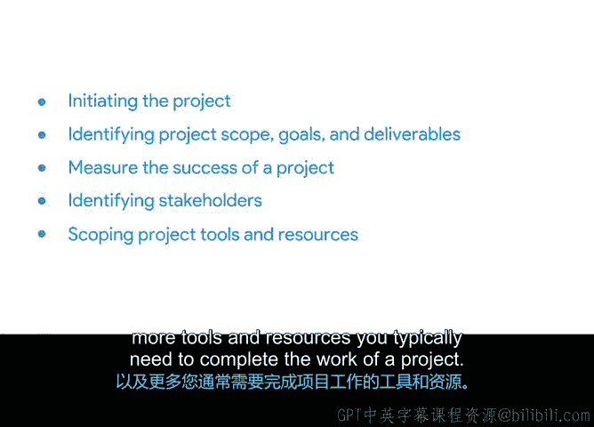

# 001：成功启动项目 🚀

在本课程中，我们将学习如何成功启动一个项目。项目启动是项目管理的关键阶段，它为项目的整个生命周期奠定了基础。我们将从项目启动的概述开始，逐步深入到其核心组成部分，如项目范围、目标和可交付成果，并学习如何衡量项目成功。此外，我们还将探讨如何识别利益相关者，定义角色与职责，以及准备项目启动所需的文档和资源。

---

## 课程介绍与讲师背景 👋

欢迎来到本课程。本课程的核心内容是成功启动一个项目。

如果您尚未学习我们的基础课程，我们建议您先学习它。该课程涵盖了项目管理的基础知识，并为任何希望开启项目管理职业生涯的人提供了大量有用信息。

全球有许多像您一样的人，希望学习技能以获得项目管理职位。您可能倾向于选择专业认证而非四年制学位，或者正在寻找一种经济实惠的方式在竞争中脱颖而出，亦或是对转行感兴趣。无论您出于何种原因来到这里，我们都非常高兴您的加入。

本课程基于一个信念：扎实的项目管理基础能帮助任何人开启出色的项目经理职业生涯。

在课程开始前，请允许我自我介绍。我叫乔安妮，是您本课程的讲师。过去八年，我作为谷歌的高级项目经理，参与了众多跨职能项目。这些项目涉及产品经理、软件工程师、用户体验设计师、网络运营、客户支持等多个团队，共同构建了谷歌内部及谷歌云客户使用的软件。

我的职业生涯始于担任客户与工程师之间的联络员，负责记录软件开发项目的需求。随着参与的项目规模扩大，我开始管理项目时间表，并协调不同团队的工作以完成项目。不知不觉中，我成为了实际的项目经理。

我通过正式和非正式的培训积累了知识，并在金融、保险和科技公司中找到了实际应用。我非常高兴能与您分享更多关于项目管理学科的知识。

---

## 课程内容概览 📚

在本课程中，您将学习启动项目的所有步骤。

我们将从项目启动的概述开始。启动阶段是让想法汇聚并形成项目计划雏形的阶段。

您将识别启动阶段的各个组成部分，例如**项目范围**、**目标**和**可交付成果**。您还将学习如何衡量项目的成功。这是整个拼图中至关重要的一块。毕竟，您希望能够满足甚至超越成功项目的所有要求，对吗？

接下来，我们将讨论如何识别**利益相关者**。利益相关者对项目的完成和成功有直接的利益关系。

我们将向您介绍一些非常有用的工具，您可以用它们来定义项目角色和职责，以及完成项目工作通常需要的更多工具和资源。

最后，我们将介绍有助于您的团队为项目启动做准备的文档。这很令人兴奋，对吧？

您在本课程中学到的技能将帮助您启动自己的项目。我们迫不及待地想与您一起探讨这些主题，让我们开始吧。下个视频见。