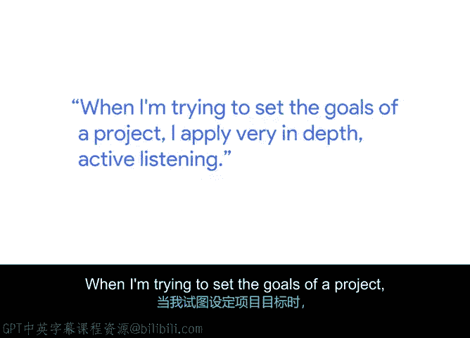
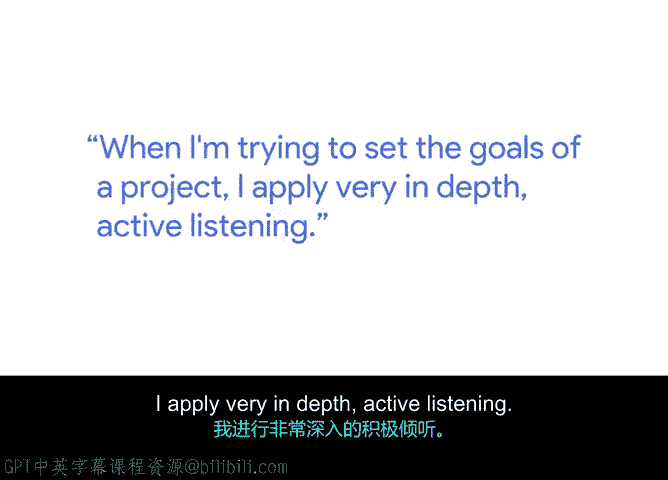
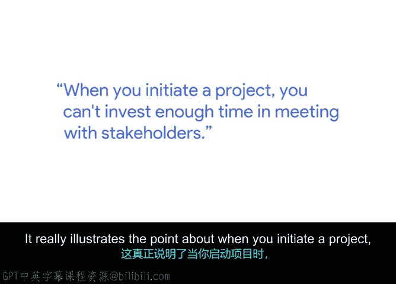
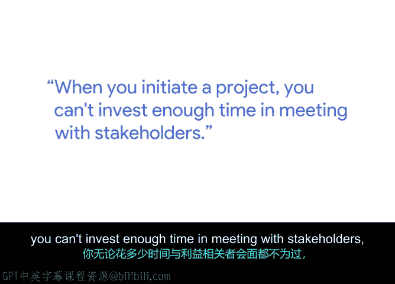

# 004：04_01_03_阿夫辛-倾听学习

## 概述 📋

在本节课中，我们将跟随谷歌核心能力总监阿夫辛，学习项目启动阶段的关键环节。我们将重点探讨如何通过积极倾听来明确项目目标、界定成功标准以及识别相关方，从而为项目的成功奠定坚实基础。

## 讲师介绍与核心职责 👨‍💼

大家好，我是阿夫辛，在谷歌担任核心能力总监。我的团队主要负责支持谷歌地图、谷歌相册、谷歌搜索等关键产品。我们的核心职责是管理产品在资源领域的供需，具体包括计算、存储、机器学习和网络资源。最终，我们的目标是为这些产品提供动力，以支持全球数十亿用户。

## 项目启动的核心要素 🎯

在启动一个项目时，我通常会关注几个核心要素。首先，是确立项目目标。与目标紧密相连的，是讨论项目的成功标准。我们需要明确什么是成功的项目，以及项目中涉及哪些可衡量的指标。最后，我总是希望审视项目涉及的相关方，例如我们的客户、关键相关方等，并确保在项目形成阶段就考虑到他们的需求和期望。

## 积极倾听：设定范围的关键 🔍

在与相关方会面时，我努力理解他们想要实现什么、我们共同想要达成什么。这个目标，可以说是设定项目范围的一个关键方面。当我试图设定项目目标时，我会运用非常深入的积极倾听技巧。

## 积极倾听的实践方法

我会与相关方进行大量沟通。我会与许多参与者会面，以了解整体情况。这确实是一种积极的倾听体验。最近我有一个项目案例，在我看来，它没有做好恰当的项目启动阶段工作。

就在上周，一个团队找到我，他们准备推出一个流程或功能。我审查后，立即意识到他们的方向存在很大偏差。他们没有与我的任何团队成员或我本人讨论过这个主题，并且他们距离推出该功能仅剩一天时间，这完全是一次失误。

这个案例充分说明了，在启动项目时，你花再多时间与相关方、与你的同事会面沟通都不为过。

## 培养“倾听学习”的能力 💪

你需要倾听他们，积极地倾听。最近有人教我认识到培养“倾听学习”能力的重要性。在项目启动阶段，对我而言，这是一项非常宝贵的才能。有些人天生具备，有些人尚未学会，也有些人永远不会去做。我相信这是一项可以训练的技能。但它要求你真正慢下来，审视你面前的全局。

## 总结 📝

本节课中，我们一起学习了项目启动阶段的核心工作。我们了解到，成功的项目启动始于明确的目标设定、可衡量的成功标准以及对所有相关方的充分考虑。其中，**积极倾听**是贯穿始终的关键技能，它能帮助我们准确理解需求、设定合理范围并避免重大偏差。记住，花时间与相关方深入沟通、培养“倾听学习”的能力，是为项目成功铺平道路不可或缺的一步。