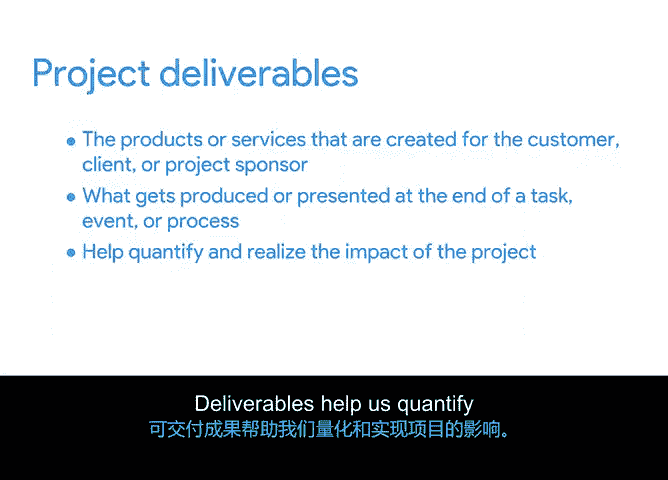

# 007：确定项目目标和交付成果

欢迎回来。在本视频中，我将定义项目目标和交付成果，并解释它们的重要性。

然后，我将教你如何判断一个目标或交付成果是否被明确定义，这意味着它拥有足够的细节和信息来引导你走向成功。

首先，为了确保项目成功并让你的工作更轻松，你需要在真正开始之前弄清楚需要做什么。你需要明确定义你的目标和交付成果，以便能够告诉团队成员该做什么。你需要清晰地了解你试图完成什么、你将如何完成它，以及你如何知道它已经完成。

让我们先定义项目目标，以便你开始思考你的项目团队需要达到什么。

## 定义项目目标

项目目标是项目期望达成的结果。它是你被要求去做的事情，也是你试图实现的事情。例如，你的目标可能是**将电子邮件客户咨询的响应时间提高20%**。你的办公室绿植项目的目标可能是**通过一项名为“Plant Picks”的新服务，在年底前将收入提高5%**，该服务为顶级客户提供最佳植物。

目标很重要，因为它们为你提供了通往目的地的路线图。如果心中没有一个清晰的目标，你如何知道该去哪里或如何到达那里？

现在，区分一个好目标和一个不那么好的目标的最大因素之一在于它被定义得有多好。也就是说，目标有多清晰和具体。如果目标是你的目的地，你是否有信心知道何时已经到达？

我之前提到的例子——“将电子邮件客户咨询的响应时间提高20%”和“将办公室绿植收入提高5%”——是两个定义明确的目标，因为它们告诉了你试图实现什么。

但等等，还有更多。这些目标还告诉了你如何去做被要求做的事情。在这个案例中，分别是“通过电子邮件”和“通过一项新的服务”。不仅如此，这些目标通过说明“提高20%”和“增加5%”进一步明确了目标。现在我们知道要去哪里了。

定义明确的目标既是具体的，也是可衡量的。它们让你清楚地了解你试图完成什么。真正出色的目标有更多的细节，我很快会讲到。

当你启动一个项目时，花时间审查你的目标，确保它们被明确定义。要做到这一点，你可能需要从利益相关者那里获取更多信息。与他们讨论他们对项目的愿景。询问这如何与公司更大的目标和使命保持一致。在那次对话结束时，你和你的利益相关者应该就支持项目目标达成一致，以避免日后出现问题。

以下是我作为项目经理的个人经验中的一个例子。我们的团队完成了一个新产品功能。我们声明的目标是**交付该功能的早期版本并收集用户反馈**。当我们将该功能交付给一位关键客户以获取用户反馈时，客户没有可用的人员来试用它。我们的团队争论我们是否达到了目标。如果我们没有收集到用户反馈，有些人认为我们没有实现既定目标，而另一些人则认为我们实现了。客户对我们团队在既定时间线内交付功能的能力感到满意。但我们内部团队浪费了宝贵的时间来回争论。

因此，请确保在开始项目之前，你、你的利益相关者和你的团队都对项目目标有清晰的认识，这样你才能知道你正在取得正确的进展。我将在接下来的内容中教你如何做到这一点。

## 定义项目交付成果

一旦目标确定下来，就该审视项目交付成果了。项目交付成果是为客户、委托方或项目发起人创建的产品或服务。换句话说，交付成果是在任务、事件或流程结束时产生或呈现的东西。

以“提高客户响应时间”这个目标为例。该目标的一个交付成果可能是**创建用于回复典型问题的电子邮件模板**。你的办公室绿植项目“增加收入”的目标可能有两个交付成果：**启动植物服务**和**一个展示所提供新植物品种的完整网站**。这些被认为是交付成果，因为它们描述了有形的产出，向利益相关者展示了额外收入将如何产生。

项目交付成果的例子多种多样。一个非常常见的例子是**报告**。当目标达成时，你可以在图表、图形或演示文稿中直观地看到记录的结果。交付成果帮助我们量化和实现项目的影响。

就像需要明确定义的目标一样，出于几乎相同的原因，你也需要明确定义的交付成果。交付成果通常是在项目开始时与涉及的利益相关者或客户共同决定的。它们让每个人都承担责任，并且通常是实现目标的重要组成部分。

确保询问交付成果应该是什么，并让每个人都分享他们对交付成果的愿景和期望，以便大家达成共识。

接下来，你将练习使用SMART方法进一步定义你的目标。请享受这个过程。😊