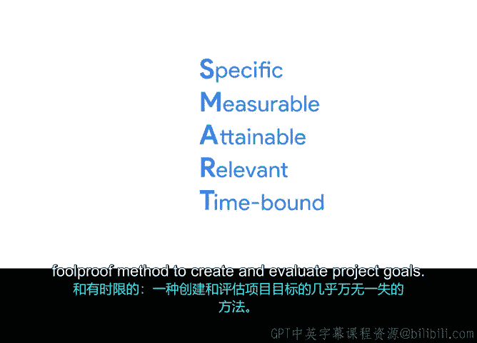

# 008：成功启动项目

## 🎯 08_02_03：如何设定SMART目标

在本节中，我们将学习一个设定清晰、有效项目目标的实用方法：SMART目标法。我们将详细拆解SMART的每个字母所代表的含义，并通过实例说明如何应用。

### 概述

明确的目标对项目的成功至关重要。它们需要被清晰地定义，以确保项目始终保持在正确的轨道上。由于项目的可交付成果依赖于目标，因此尽可能清晰地定义这些目标符合你的最佳利益。幸运的是，有一个简单的方法可以做到这一点：设定SMART目标。

### 深入解析SMART目标

SMART是一个评估目标是否有效的框架。它要求目标满足五个标准：**具体**、**可衡量**、**可实现**、**相关**和**有时限**。作为一名初级项目经理，你可能不负责设定项目的主要目标，但你需要能够识别并在必要时澄清它们。SMART方法正是一个有价值的工具。

接下来，让我们逐一审视每个标准。

#### 具体

如果目标不具体，你将很难确定完成它需要多长时间，以及你是否已经完成了它。例如，“改善客户服务响应时间”这个目标就不够具体。它虽然告诉你大致想要实现什么，但没有提供更多细节。

具体的目标应至少回答以下两个问题：
*   **我想完成什么？**
*   **为什么设定这个目标？** 它是否有特定的原因、目的或益处？
*   **涉及谁？** 谁是接收者？是员工、客户还是更广泛的社区？
*   **目标应在何处交付？**
*   **达到什么程度？** 换句话说，**要求和约束条件是什么？**

#### 可衡量

我们需要设定可衡量的目标，这意味着我们可以客观地判断目标是否已达成。衡量不仅是跟踪进度的方法，也是帮助人们保持动力的工具。

你可以通过问“多少”、“多少个”以及“我如何知道它已完成”来判断一个目标是否可衡量。有时，目标的成功可以用简单的“是”或“否”来衡量。但大多数目标需要使用**指标**来衡量。

**指标**是你用来衡量事物的标准，例如数字或数据。例如，如果你的目标是跑完5公里，那么“公里数”就是一个指标。在Office Screen项目中，目标是“将收入提高5%”，这里的“收入”就是指标。

最后，考虑使用**基准**或参考点来确保你选择了准确的指标。例如，如果你的总体目标是增加收入，你可以将去年的数据作为基准，来决定今年增加多少收入是合理的。

#### 可实现

目标需要是可实现的。它能否根据指标被合理地达成？通常，你希望目标具有一定挑战性以促进成长，但又不至于过于极端而导致根本无法实现。

例如，假设你每周跑步三次，每次2.5公里。一个可实现的目标是“在四周内从跑2.5公里提升到跑5公里”。而一个可能无法实现的目标是“在5公里比赛中获得第一名”。

如果你对一个目标不熟悉，如何判断它是否可实现呢？一个线索是问：“如何实现它？”将目标分解成更小的部分，看看是否合理。将同样的过程应用于Office Screen的项目目标：如果需要在一年内将收入提高5%，那么每个季度需要提高约1.25%。这看起来相当合理。

#### 相关

目标必须是相关的。换句话说，尝试达成这个目标是否有意义？思考这个目标如何与其他目标、优先事项和价值观保持一致。

问问自己：这个目标是否值得付出努力？投入与回报是否平衡？它是否符合组织的其他需求和优先事项？从客户、项目团队到最终产品用户，每个人都应该觉得这个目标值得支持。

同时，考虑时机因素。项目所需的时间，以及更大的经济和社会背景，都可能产生重大影响。

#### 有时限

目标必须有时限，即有一个截止日期。截止日期为你提供了一种跟踪进度的方法。否则，你可能永远无法达成目标，甚至无法开始。

时间和指标常常相辅相成，因为时间本身也可以作为一个指标。使目标具有时限性，让你能够分解出在一段时间内需要完成多少工作。例如，如果你需要在年底前增加收入，你可以分解出每个季度、每个月、每周需要增加多少。

### 总结

至此，我们完成了对SMART目标法的学习。**具体、可衡量、可实现、相关、有时限**，这是一个近乎万无一失的创建和评估项目目标的方法。

正如人们常说的，要更聪明地工作，而不是更努力地工作。随着我们在本模块中继续学习项目范围，你将看到清晰的目标如何支持项目期间出现的各种其他决策。