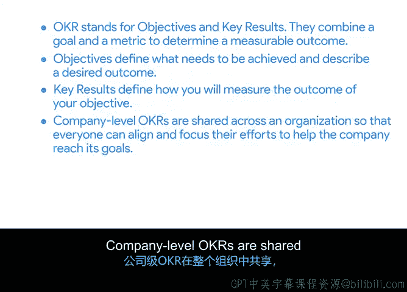

# 009：OKRs方法介绍

在本节课程中，我们将学习一种在谷歌及众多组织中广泛使用的流行工具——目标与关键成果法。我们将了解OKRs是什么，组织如何使用它们，以及它们如何帮助团队将时间和精力集中在推动成功的活动上。

到目前为止，你已经学习了如何定义和创建可衡量的项目目标与交付成果。随着你对项目管理及其可用工具理解的加深，本节将介绍目标与关键成果法。

## 什么是OKRs？

上一节我们介绍了定义项目目标的SMART原则。与SMART原则类似，OKRs帮助为组织、部门、项目或个人建立和澄清目标。OKRs通过将目标与更详细的衡量指标相结合来确定可衡量的成果，从而将SMART目标更进一步。

OKRs不仅清晰地陈述目标是什么，还提供了衡量目标成功与否的具体细节。一种理解OKRs的方式是，它将SMART目标的各个组成部分分离出来，并进一步澄清，而不是将所有内容归入一个陈述中。

让我们来分解一下：
*   **O代表目标**：它定义了需要实现什么，描述期望的结果或成果。例如：提高客户留存率或改进员工入职流程。
*   **KR代表关键成果**：这些是可衡量的成果，定义了目标何时达成。例如：如果目标是提高客户留存率，那么一个关键成果可能是在第一季度末实现90%的客户满意度评分。

需要回顾的是，SMART标准之一是**可实现性**，意味着目标是实际可达到的。然而，关键成果应该更具挑战性一些。在谷歌，我们实际上使用OKRs来设定**延伸目标**，以此挑战自己完成以前未曾实现的事情。如果我们真的完成了所有的关键成果，可能意味着我们的OKRs设定得有点太简单了。

让我们快速回顾：**目标**定义需要实现什么并描述期望的成果；**关键成果**定义你如何知道是否达成了目标。

## OKRs如何实践？

那么，OKRs在实践中如何运作？你如何用它们来管理项目？

组织通常在不同层级设定OKRs，例如公司层级、部门或团队层级以及项目层级。

以下是不同层级OKRs的说明：

*   **公司层级OKRs**：通常在整个组织内共享，以便每个人都清楚公司的目标。它们通常每年更新，以帮助推动组织朝着期望的方向发展。这些高层级的OKRs支持组织的使命。
*   **项目层级OKRs**：应该支持并与公司层级的OKRs保持一致。项目层级的OKRs在启动阶段设定，以帮助定义可衡量的项目目标，并在规划和执行阶段进行跟踪以衡量项目成功。
*   **团队或部门层级OKRs**：支持公司更广泛的OKRs，并帮助推动团队绩效。部门也可能制定与其职能更相关的OKRs。

## OKRs应用示例

让我们通过一个虚构公司“Office Green”的例子来看OKRs如何在不同层级对齐。

**公司层级目标**：通过适应不断变化的工作环境来提高客户留存率。这是一个适用于整个公司及其所有事业的大胆、富有抱负的目标。

为了集中努力实现这个目标，Office Green可能制定以下关键成果：
*   95%的电话、聊天和电子邮件客户支持工单在首次联系时得到解决。
*   针对分布式办公环境需求最高的三项新服务在第二季度末进入试点阶段。
*   销售和支持渠道在年底前实现7x24小时可用。

其中一些公司层级的关键成果可能成为项目的基础。例如，关键成果“针对分布式办公环境需求最高的三项新服务在第二季度末进入试点阶段”就可能成为“Plant Pals”项目。

部门层级的OKRs同样支持公司目标。例如，公司层级的关键成果“销售和支持渠道在年底前实现7x24小时可用”可能导致销售部门制定一个相关目标，例如：**扩大销售团队在全国范围内的覆盖**。其关键成果可能是：**在年底前在10个城市开设新的销售办事处**。

项目层级的OKRs需要与公司和部门层级的OKRs保持一致并予以支持。例如，为了与Office Green公司“通过适应不断变化的工作环境来提高客户留存率”的整体目标保持一致，“Plant Pals”项目的目标可能是：**让现有客户注册Plant Pals服务**。此目标的一个关键成果可能是：**25%的现有客户注册Plant Pals试点计划**。

## 本节总结

在本节课中，我们一起学习了OKRs方法。**OKR代表目标与关键成果**。它将目标与衡量指标相结合，以确定可衡量的成果。

*   **目标**定义需要实现什么并描述期望的成果。
*   **关键成果**定义你如何衡量目标的成果。

公司层级的OKRs在整个组织内共享，以便每个人都能协调并集中精力帮助公司实现其目标。项目层级的OKRs帮助定义可衡量的项目目标，它们需要与公司和部门层级的OKRs保持一致并予以支持。

现在你对OKRs是什么以及如何运作有了更好的了解，你可以尝试自己创建OKRs了。

