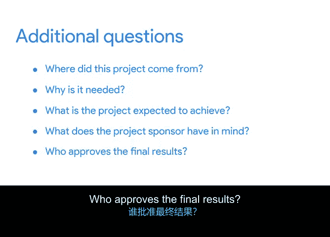

# 010：确定项目范围 📋

在本节中，我们将学习项目范围这一核心概念。了解如何定义和确定项目范围，是确保项目目标清晰、资源合理分配的关键。

## 概述

项目范围定义了项目的边界。明确的范围有助于确保项目被清晰地定义和规划。这意味着需要准确了解项目的交付对象、最终用户、复杂程度、时间线、预算和资源。范围界定不清或发生重大变更，可能导致预算、时间线甚至最终成果的改变。

## 什么是项目范围？

简单来说，**项目范围**包含了项目的边界。我们可以将其定义为：关于项目中包含什么、不包含什么的共同理解。

范围有助于确保你的项目被清晰地定义和规划。这意味着你需要确切知道项目将交付给谁，以及谁将使用项目的最终成果。

你还需要对项目的复杂性有坚定的理解。项目是任务清单简单直接、易于管理，还是需要进行广泛研究、多轮审批，并涉及需要数年才能完成的大规模生产流程？

范围还包括项目的时间线、预算和资源。你需要清晰地定义这些内容，以确保工作在既定边界内进行，并明确项目可行的实际条件。

## 项目范围示例：办公室绿植项目

让我们以你的办公室绿植项目为例，看看范围可能包含哪些内容。

该项目提供小型、低维护的植物（如仙人掌和多叶蕨类），客户可将其放置在办公桌上。客户可以通过在线方式或印刷目录订购，办公室绿植服务将把植物直接寄送到客户的工作地址。

那么，在考虑项目范围时，可能需要思考以下几点：
*   是否提供替换植物服务。
*   向哪些客户群体提供该服务。
*   在线目录是应用程序、网站，还是两者兼有。
*   如何确保客户能从在线目录购买（例如，通过手机、PC、Mac、iPhone或Android）。
*   纸质目录的尺寸、是否需要彩色印刷、使用何种纸张。

## 如何确定项目范围？

确定项目范围的方法很简单：与你的项目发起人和相关方沟通。

了解他们的目标，并找出项目中**包含什么**以及（这一点非常重要）**不包含什么**。

我们已经介绍了一些帮助你确定范围的不同方法。以下是更多有用的问题，可以添加到你的清单中：
*   项目从何而来？为什么需要它？
*   项目预期实现什么目标？
*   项目发起人有什么想法？
*   谁批准最终成果？

## 确定范围的时机与记录

在时间安排上，定义项目范围应发生在初始规划阶段。

你希望尽早开始确定范围，以便每个人都能就同一套期望达成一致。这将有助于减少后期发生重大变更的风险。

当然，在规划过程中，如果需要，你随时可以调整范围。

一旦你理解了项目范围，就需要记录所有细节，以便在项目生命周期中任何人都可以参考。我们将在本模块末尾讨论一些相关的最佳实践。

## 总结

在本节中，我们一起学习了项目范围。一个清晰定义的范围描述了项目的所有细节，并规定了在项目进展过程中可以添加或删除的内容。

虽然监控项目并确保所有工作和资源都在其范围内，最终是项目经理的责任，但可以通过鼓励团队成员和相关方专注于对实现项目目标最重要的任务，来让他们各尽其责。

下一节视频将讨论“范围内”、“范围外”的概念，以及被称为“范围蔓延”的现象。这三者都将有助于确保你的项目按计划进行并保持在预算之内。