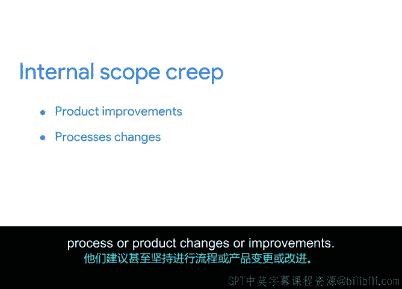

# 011：项目范围的监控与维护 🛡️

在本节课中，我们将学习如何监控和维护项目范围，这是确保项目按计划进行、避免范围蔓延的关键环节。我们将了解范围的定义、范围蔓延的来源以及如何有效管理它。

## 项目范围的定义

上一节我们介绍了项目启动的基础，本节中我们来看看如何界定项目范围。项目范围明确了项目的边界。

*   **范围内任务**：指包含在项目中，并为项目总体目标做出贡献的任务。
*   **范围外任务**：指未包含在项目计划中的任务。

项目经理的职责是为项目设定并维护清晰的边界，以确保团队能按计划推进。例如，在为植物P目录项目工作时，如果文案或设计师提出向顶级客户扩展植物类型的想法，项目经理必须指出该建议属于范围外，会增加额外时间和预算成本。

## 理解范围蔓延

随着项目生命周期的推进，你可能会遇到意外挑战，或接触到可能影响项目成功的新细节或想法。

**范围蔓延** 指的是项目开始后，任何影响项目范围的变更、增长或不可控因素。这是一个普遍存在的问题，控制起来并不容易，是每个项目都可能面临的挑战。

范围蔓延可能发生在任何行业、任何项目中。设想你在一个科技公司，项目是与设计师和工程师合作，更新智能手机键盘应用中语言图标的设计。

*   团队在进行更新时，认为搜索图标和语音输入图标也需要重新设计。这些改动虽小且技术上不属于范围，但团队认为只需付出极小努力就能带来巨大价值，于是进行了更新。
*   在利益相关者评审中，有人指出目前只有英文键盘，建议设计其他语言的键盘。此时，项目范围面临从简单的图标更新，扩展为复杂的多键盘布局全面更新的风险。

增加键盘设计会影响团队的时间线，导致项目延期。它还会影响资源，因为需要招聘更多人，或现有成员必须加班。同时，预算也会增加，因为团队未预料到额外工时或键盘翻译的成本。

这只是范围蔓延的一个例子。有时它很微妙，比如“多设计一两个图标”；有时则很明显，比如“能否顺便设计其他语言的键盘”。通过识别范围蔓延并采取主动措施，你可以保护项目和项目团队。

## 范围蔓延的来源及应对

为了帮助你应对范围蔓延，了解其两大主要来源很有帮助：外部来源和内部来源。

### 外部来源的范围蔓延

外部来源的范围蔓延相对容易识别。例如，主要客户可能请求变更，或商业环境、底层技术可能发生变化。

虽然无法控制所有事情，但可以记住以下有用建议：

以下是应对外部范围蔓延的关键步骤：

1.  **确保利益相关者对项目有清晰可见性**：让他们了解将要交付产品的细节、所需资源、成本和时间。
2.  **明确需求并征求对初始产品提案的建设性批评**：在签署任何合同前获取这些信息至关重要。
3.  **为利益相关者的参与设定基本规则和期望**：就项目执行和状态评审期间各自的角色和职责达成一致。
4.  **制定处理范围外请求的计划**：商定谁可以提出正式变更请求，以及这些请求将如何被评估、接受和执行。
5.  **确保将这些协议书面化**：这样，如果未来与利益相关者或客户产生分歧，你始终有据可查。

外部范围蔓延的一个主要原因是，在定义范围并获得正式批准推进项目之前，需求不够明确。这就是为什么具体、可衡量的目标和可交付成果如此重要。如果需求不具体，且未就项目流程、可交付成果和里程碑达成一致，那么项目一旦开始，几乎必然会面临范围蔓延。

### 内部来源的范围蔓延

内部来源的范围蔓延更难发现和控制。这种蔓延来自项目团队成员，他们建议甚至坚持对流程或产品进行变更或改进。

*   产品开发人员可能以“让产品更好”为由证明某项决定的合理性，尽管这会增加成本。
*   团队负责人可能认为某个流程更高效，却没有意识到流程变更会对负责项目其他部分的其他成员产生影响。

你需要向团队明确：任何超出项目范围的变更都会影响利润、威胁进度并增加风险。**对项目范围没有小影响**。每当团队成员承担一项计划外任务时，损失的不仅仅是完成该任务所花费的时间。

作为项目经理，维护项目边界是你的责任。最好的防御方法是透彻了解项目的所有细节，以便随时准备好对新想法或请求做出最恰当的回应。

## 总结

本节课中我们一起学习了如何监控和维护项目范围。监控项目范围并全力保护它至关重要，即使是最微小的变更也可能对项目成功产生重大影响。

接下来，我将介绍三重约束模型，以及如何利用它来帮助确定项目变更如何影响范围。敬请关注。