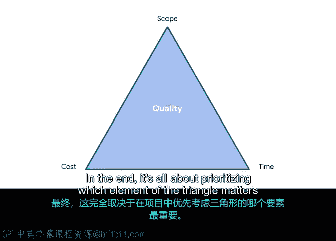

# 012：项目范围变更管理 📊

在本节中，我们将学习如何管理项目范围。项目范围定义了项目的边界和交付内容，而范围变更管理则是确保项目在面临变化时仍能按计划推进的关键技能。我们将探讨范围、时间和成本之间的相互制约关系，并通过实际场景来理解如何权衡变更的利弊。

## 概述：理解项目范围管理

项目范围管理与目标设定紧密相连。例如，重新定义范围可能改变项目目标，而修订目标也可能影响范围。项目范围的概念在整个项目周期中都至关重要。虽然每个项目都有其特定目标，但作为项目经理，你的总体目标是按照范围协议交付项目。这包括在给定的截止日期和批准的预算内完成项目。

你会发现，这说起来容易做起来难。随着项目的推进，你将不断需要在新挑战、变化和因素出现时做出妥协和权衡。每当团队成员承担一项计划外的任务时，损失的不仅仅是完成该任务所花费的时间。

## 核心模型：三重约束

为了判断范围变更是否可接受及其影响，项目经理通常会参考**三重约束模型**。该模型结合了任何项目中最显著的三个限制因素：**范围**、**时间**和**成本**。

我们已经讨论了范围是什么，现在让我们聚焦于时间和成本。

*   **时间** 指项目进度和截止日期。
*   **成本** 包括预算，也涵盖资源和项目工作人员。

时间和预算都必须与范围一起谨慎管理。这三者相互关联，改变其中任何一个都会对另外两个产生影响。

**公式表示：**
`项目成功 ≈ 平衡(范围, 时间, 成本)`

例如：
*   成本降低意味着时间或范围需要改变。
*   时间增加意味着范围或成本，或两者都需要改变。

理解改变一个因素如何影响另外两个约束是关键。随着项目进展，考虑你愿意做出哪些权衡非常重要。要成功做到这一点，你需要清楚了解项目的优先级。你必须知道在范围、时间和成本方面，什么是最重要的。

## 权衡决策与优先级

如果有一个必须满足的特定截止日期，那么你需要限制任何可能导致项目超期的范围变更。如果产品必须以某种方式外观或运行，那么需求就是优先事项，你可以为了满足范围要求而调整成本或时间。

但仅仅因为你可以做出改变，并不意味着你必然应该做出改变。即使范围、时间和成本的限制已经设定，如果有充分的理由，你仍然可以进行调整。请放心，你无需独自决定这些变更。如果需要做出范围决策，项目经理可能需要咨询项目发起人和利益相关者以获得他们的批准。

以下是几个场景，帮助你熟悉权衡利弊和理解变更影响。

### 场景分析

以下是几个需要权衡变更的场景：

**场景一：功能增强请求**
产品总监希望使用能指示植物需要浇水的花盆。这是范围变更。你知道不能改变预算，但可以延长时间线。因此，只要预算不增加，你可以接受范围变更请求并延长截止日期。

**场景二：预算削减请求**
要求在不对范围做任何改变的情况下减少预算。为了在减少预算的同时保持范围不变，你可能需要延长项目时间线。

**场景三：提前完成请求**
要求缩短时间线并提前完成，但不能增加预算。为了实现这一点，你需要调整范围，例如限制运输选项。这样做将为你的项目争取更多时间，因为你需要谈判的运输合同减少了一个。最终结果不会与最初商定的完全一致，但意味着可以按要求更早推出产品，并且不超预算。

**场景四：截止日期为最高优先级**
产品总监告知你项目截止日期必须满足，这是最重要的事。在这种情况下，你的利益相关者愿意增加预算并对范围要求做出任何必要更改，以确保按时交付。

归根结底，这一切都关乎于优先考虑三角形（范围、时间、成本）中哪个元素对项目最为重要。

## 总结：为成功管理变更

你开始掌握权衡的技巧了吗？在管理项目时牢记范围、时间和成本，将帮助你在不同条件下导航，同时仍能实现目标。

请记住，变化在项目管理中是不可避免的。理解三重约束框架可以帮助你相应地规划和沟通，从而确保项目成功。当你理解了三重约束模型，你就拥有了评估范围变更的工具。理解变更将如何被评估、接受和执行，是范围管理的关键。

如果你仍有疑问，请不要担心，我们将在课程后续部分更多地讨论这个概念。

接下来，我们将进一步讨论如何成功启动和落地你的项目。下次见。