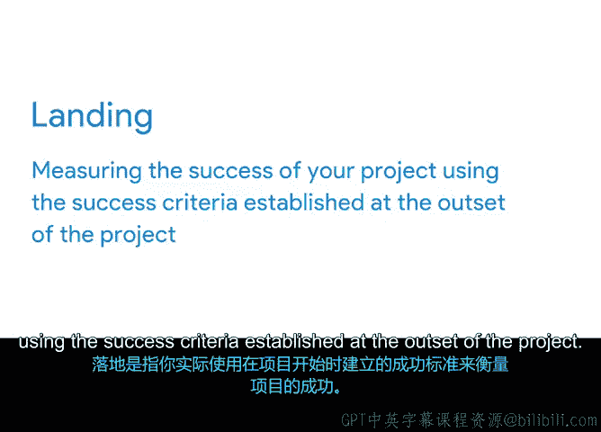

# 014：项目启动与落地 🚀

在本节课中，我们将学习项目成功的关键环节——从“启动”到“落地”的完整过程。我们将探讨为何仅仅完成项目交付（启动）并不等同于成功，以及如何通过定义明确的“成功标准”来确保项目真正实现其目标并平稳“落地”。

## 从启动到落地：定义项目成功

上一节我们介绍了设定SMART目标和管理项目范围。具备了这两个重要部分后，你可能会认为已经准备好启动项目了。然而，还有一个关键要素能确保你在既定范围内达成这些目标。

这个关键要素就是明确知道项目何时才算真正交付，并可以称之为成功。

许多人认为，判断项目是否成功的时机是在你产出最终成果并呈现给客户时。这已经很接近了——将项目的最终成果交付给客户或用户，这被称为**项目启动**。此时，你已完成项目的构建或创建，任务已完成，可交付成果也已就绪。你达成了目标，从这个意义上说，项目是成功的，可以被视为完成了。

但是，它运行良好吗？它是否达到了你期望的成果？项目成功的真正决定因素在于你对最终成果进行测试之时。

**落地**是指你实际使用项目初期确立的成功标准来衡量项目是否成功。

这是目标设定中至关重要的一部分，却常在启动阶段被忽视。

## 启动与落地的区别 ✈️

为了更好地理解，让我们用一个比喻来说明。

想象一下乘坐飞机旅行。对飞行员而言，仅仅能让飞机起飞是不够的。为了安全抵达目的地，他们必须知道如何降落。

你的成功必须延续到交付最终项目之后。你需要能够衡量项目投入实践后是否按预期运行。

让我们以你的“植物伙伴”项目为例。你已成功推出了这项新服务：网站上线、产品目录印刷并分发、收到了订单、收入开始增长。此时很容易宣布胜利并转向其他工作。

但如果客户收到植物后不满意怎么办？如果几周后植物开始枯萎、变色怎么办？仅仅因为项目启动并交付出去在纸面上看起来成功，并不意味着项目对大多数人而言已经成功“落地”。

对于大多数项目而言，启动本身并不是衡量成功的有效标准。真正重要的是启动之后发生的事情。启动只是达到目的的一种手段，而展望启动之后的阶段对于确保启动实现你的总体目标至关重要。

如果你从一开始就超越启动，着眼于落地，你更有可能到达你试图去往的目的地。

## 定义成功标准：确保平稳落地 🎯

由于“落地”是一个概念而非明确的定义，因此为特定项目定义成功的“落地”具体是什么样子就非常重要。

幸运的是，我们有一种方法来衡量并帮助你确保项目的成功。它被称为**成功标准**。如果你能在项目的整个生命周期中遵循它，你最终将实现平稳落地。

以下是成功标准的核心作用：

*   **包含具体细节**：成功标准包含了你目标和可交付成果的所有具体细节。
*   **作为行动指南**：它可以作为指南，让你知道自己是否完成了既定任务。
*   **设定评判标准**：成功标准将为如何评判你的项目设定标准。

在下一节视频中，我将概述你需要了解的关于定义成功标准和沟通项目成功的要点。

## 总结

本节课中，我们一起学习了项目从“启动”到“落地”的全过程。我们明白了项目成功不仅在于完成交付（启动），更在于交付后的实际效果和成果（落地）。通过提前定义清晰、具体的**成功标准**，我们可以有效地衡量项目是否真正达到了预期目标，从而确保项目最终实现平稳、成功的落地。记住，着眼于落地能引导你的项目走向真正的成功。