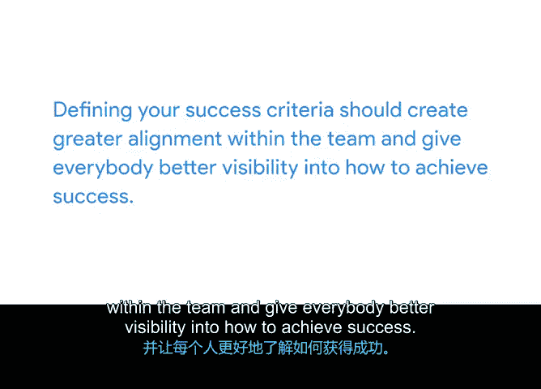

# 015：定义成功标准

在本节课中，我们将要学习如何定义项目的成功标准。这是确保项目不仅被“发射”，而且能成功“着陆”的关键步骤。我们将探讨如何设定可衡量的标准，以便在项目结束时能够客观地判断其是否成功。

## 理解成功标准的重要性

上一节我们介绍了项目“发射”与“着陆”的区别，以及交付项目与验证成果的区别。本节中，我们来看看如何具体判断一个项目是否成功。

成功标准用于判断整个项目是否成功。它们是项目目标和交付成果的具体细节，指明了你是否完成了既定任务。这些标准是项目交付给利益相关者和客户后，对其进行评判的依据。

定义成功标准还能向团队阐明，除了向用户发布产品外，他们真正要达成的目标是什么。例如，是为了提升客户满意度以促进更多购买，还是为了增强现有功能以留住客户？答案因项目而异，但重要的是团队必须目标一致，共同朝着一个共享的目标努力。

## 如何定义成功标准

定义成功标准没有固定的流程，但我们可以考虑以下几个关键点。

首先，回想制定SMART目标时“可衡量”的部分。一个关键问题是：“我如何知道目标已经达成？” 同样，对于项目，你需要问：“我如何知道项目已**成功**完成？”

你可以通过类似于衡量目标的方式来衡量项目成功。因此，你需要梳理项目目标和交付成果，审查范围，并识别项目中所有可衡量的方面。这些方面包括目标和交付成果中使用的任何指标，以及预算和时间表的细节。

其次，你需要从利益相关者那里获得关于项目需求和期望的清晰说明。这一点至关重要。任何项目都涉及许多人，这意味着每个人对成功的看法可能不同。你需要提出以下问题：
*   谁最终有权判定项目是否成功？
*   将衡量哪些标准来确定成功？
*   本项目成功的依据是什么？

收集到澄清信息后，请将其记录并分享，以便你、你的团队和利益相关者日后参考。

## 创建成功标准的实例

让我们尝试为“办公室绿植”项目创建成功标准。例如：
*   **目标**：在年底前将收入提高5%。
*   **交付成果之一**：一个展示不同可选植物的网站图库。

仅仅列出标准是不够的。你需要一个从项目开始到结束、贯穿整个生命周期的衡量成功的过程。这样，你才能进行调整，确保在准备“着陆”时取得成功。

## 选择与衡量指标

你可以使用许多指标，对于某些产品，使用多个指标是合理的。你选择的指标应尽可能与项目范围紧密相关。

以下是几种常见的指标类型：
*   **满意度指标**：衡量用户态度和满意度，或感知易用性。可以通过调查来衡量。对于“植物伙伴”项目，我们可以将“上线后前三个月内客户满意度达到85%”作为衡量成功的一个标准。
*   **客户采用与参与度指标**：以及更偏向业务、跟踪销售和增长等的指标。
    *   **采用**指的是客户如何顺利使用并接受某项产品或服务。采用指标可能包括：向一组用户推出新产品，并让其中大量用户使用或采纳。
    *   **参与度**指的是客户互动和参与的频率或意义。参与度指标可能包括：提高某个设计功能的日使用率，或增加订单和客户互动。

以“办公室绿植”项目为例：
*   跟踪有多少客户最初注册并使用植物伙伴服务，这是一个**采用指标**。
*   跟踪有多少客户续订服务、发布相关内容或分享反馈，这些是**参与度指标**。

## 建立衡量流程

一旦定义了要衡量的指标，接下来就需要考虑如何跟踪这些指标。评估哪些工具可以帮助你收集所需数据，以确保项目保持在正轨上。

例如：
*   如果你衡量的是收入等业务指标，可以考虑在电子表格或仪表板中进行跟踪，以便轻松发现差距和趋势。
*   如果你衡量的是客户满意度，可以想办法激励客户参与定期的电子邮件调查，并创建一个系统来衡量他们的回复。
*   你还可以利用项目管理工具来检查效率指标，例如任务完成百分比，或项目是否按计划时间线推进。

在项目或产品进行过程中与团队一起衡量成功是明智的做法。例如，你可以每月举行一次项目评审，让团队成员在特定截止日期前完成任务清单，或与用户/客户举行实时反馈会议。

衡量成功的方法有很多。关键在于选择最适合你成功标准的方法。一个好的做法是，在列出每条成功标准的同时，也注明将如何衡量成功、衡量的频率以及由谁负责衡量。

## 沟通与确认

将你的成功标准文档分享给利益相关者，并询问他们是否同意项目成功的判定方式。让相关的利益相关者签字确认成功标准也是一个好主意。这样，每个人都能清楚各自的任务职责，并透彻理解通往成功的路径所包含的内容。

在整个项目期间，保持这份文档的可见性，并在每一步都与你的团队清晰沟通。他们是努力满足各项要求的人，因此不要让他们对自己应该做什么或如何做一无所知。

如果操作得当，定义成功标准应在团队内部创造更强的一致性，并让每个人都能更清楚地了解如何取得成功。

明确成功指标也有助于团队优先处理对其用户影响最大的工作。

定义项目成功是项目管理中复杂但至关重要的一部分。随着越来越多的实践，这个过程在规划阶段乃至整个项目期间对你来说都会变得更加自然。

在本节课中，我们一起学习了如何定义项目的成功标准。我们探讨了成功标准的重要性、如何从目标和交付成果中推导出可衡量的标准、如何选择合适的指标（如满意度、采用率、参与度），以及如何建立跟踪和衡量这些指标的流程。最后，我们强调了与团队和利益相关者沟通并确认这些标准的重要性，以确保所有人目标一致，共同迈向成功。