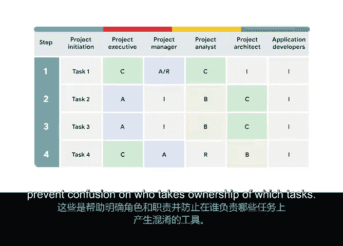

# 017：成功启动项目

## 课程概述

在本节课中，我们将要学习项目利益相关者的相关知识，并了解他们对项目成功的重要性。我们将探讨利益相关者的定义、角色、职责，以及用于明确职责和避免混淆的关键工具。

---

## 引言：与利益相关者高效协作 🎯

欢迎回来。本模块将全面介绍利益相关者及其对项目的重要性。

在上一系列视频中，我们学习了项目范围的方方面面。在探讨项目如何处于范围内或范围外的同时，我们学习了如何设定**SMART目标**。我们还讨论了启动项目与成功交付项目之间的区别。接下来，我们将探讨更多令人兴奋的主题。

在本模块中，我们将深入学习利益相关者。请记住，利益相关者扮演着关键角色。他们是对项目的完成和成功感兴趣并受其影响的人。你将看到，每个参与者都有明确的角色和职责，以帮助项目成功落地。

这些角色包括项目发起人、客户、团队成员。当然，还有你——项目经理。你还将了解诸如利益相关者映射与分析、**RACI矩阵**等工具。这些工具有助于明确角色和职责，并防止在任务归属问题上产生混淆。

---

## 模块学习内容与实践

在本模块中，你将通过大量的实践活动、讨论提示和阅读材料，来真正掌握如何启动一个项目。当我们学习每一项新技能时，可以想象成在核对一份待办事项清单。没有什么比划掉一项已完成的任务更令人满足的了。

---

## 课程总结

本节课中，我们一起学习了利益相关者的核心概念及其在项目中的关键作用。我们明确了不同利益相关者的角色与职责，并介绍了用于梳理这些关系的实用工具，为成功启动和管理项目奠定了坚实基础。