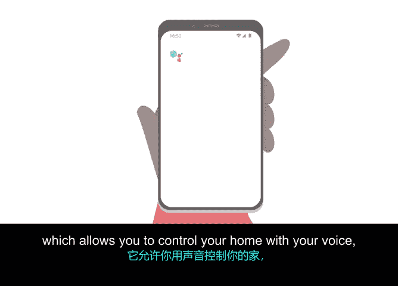

# 018：项目经理的可访问性要求 👨‍💻

## 概述
在本节课程中，我们将探讨项目管理中一个至关重要但常被忽视的方面：可访问性。我们将了解什么是可访问性，为什么它对项目经理和项目成功至关重要，以及如何将可访问性思维融入你的日常工作。

---

大家好，我是霍莉，我将担任本课程的可访问性指导老师。

可访问性应融入公司内的每一个角色，无论是产品设计师、沟通者、开发人员，还是项目经理。

作为谷歌的可访问性教育项目经理，我的职责是确保所有谷歌员工都接受可访问性教育——从为全世界构建可访问的产品，到在本课程中与大家沟通可访问性知识。

我本人是听障人士。因此，我也能以残障人士的身份分享我的经历，并帮助他人理解：残障本身并非障碍，真正的障碍在于我们周围的世界，我们必须努力让这个世界对所有人都可访问。

---

## 什么是可访问性？
可访问性可以从多种不同角度定义。对我而言，它意味着**主动消除任何可能阻碍残障人士访问技术、信息或体验的障碍，并创造一个公平的竞争环境，让每个人都有平等的机会享受生活和获得成功。**

---

## 理解残障
残障通常被定义为一种**在相当程度上限制主要生命活动（如行走、交谈、看、听或学习）的身体或精神状况**。全球有超过10亿人患有残障。

这个数字超过了美国、加拿大、法国、意大利、日本、墨西哥和巴西的人口总和。残障是多样且交叉的；一个人可能天生带有某种状况，也可能在后天生活中获得。残障可能以某种方式影响我们所有人，无论是直接还是间接，并且可能发生在任何时间。

残障的形式多种多样：
*   **永久性**：例如失聪。
*   **临时性**：例如腿部骨折。
*   **情境性**：例如在黑暗中试图操作电视遥控器。

---

## 可访问性的广泛益处
上一节我们定义了残障的多样性，本节我们来看看为残障人士创建解决方案带来的广泛影响。

当你为残障人士创建解决方案时，你不仅服务于永久性残障这一关键受众，同时也为所有可能随时间推移而暂时或情境性地处于残障状态的人解锁了次要益处。

随着你在本课程中的深入，同样重要的是要考虑到你的同学。设定一个期望——你将与那些学习和工作方式不同的人互动——这是心怀可访问性进行工作的一个关键优势。询问他人需要你提供什么以便学习和沟通，同时如果你本人有残障，也分享你的需求，这对于团队良好协作至关重要。

---

## 项目管理中的可访问性
在项目管理中，你自己、项目团队成员或高度参与你项目的人，都可能患有残障（无论是可见的还是不可见的）。

作为一名项目经理，你的职责是确保一群人能够使用共享的工具和系统聚集在一起，以实现共同目标。为了取得成功，你需要确保你建立的基础设施和文化适用于每个人。

认识到这一点是项目管理的一个关键要素。我将教你如何使你的工作和内容具有可访问性。

---

## 成为更好的项目经理
通过在未来项目中考虑可访问性，我也将帮助你成为一名更好的项目经理。我将在整个课程中提供技巧和最佳实践，就从这一点开始：

你知道吗？我们如今享用的许多技术最初都是一项可访问性功能。

想想**Google助理**，它允许你用语音控制你的家；或者**隐藏式字幕**，它让你能在拥挤嘈杂的酒吧里看电视。

通过考虑可访问性，你可以让每个人的生活变得更美好。我期待在课程中与你分享更多，同时你也能学习更多项目管理知识并为在这一领域的职业生涯做好准备。

下次见。

---

## 总结
本节课我们一起学习了可访问性的核心概念及其在项目管理中的重要性。我们了解到，可访问性关乎消除障碍、创造公平环境，并且其益处远超残障群体本身，能惠及所有人。作为项目经理，主动构建可访问的基础设施和文化，是确保项目团队成功协作、项目成果广泛适用的关键。记住，许多伟大的创新都始于可访问性的需求。