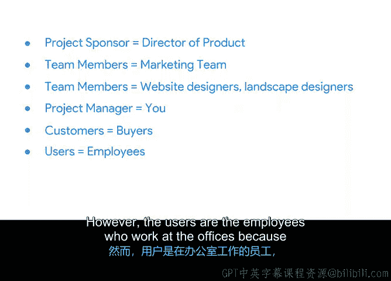

# 020：定义项目角色 🎯

在本节中，我们将学习如何定义项目中的关键角色。明确每个角色的职责对于项目的成功至关重要，它能确保团队成员清楚自己的任务，并建立起相互的信任。

## 概述

上一节我们讨论了组建团队的重要性。本节中，我们将具体了解一个项目中通常包含哪些角色，以及每个角色的核心职责。清晰的角色定义是项目顺利启动和运行的基石。

## 项目角色的重要性

正如上一视频所提及，当你管理一个项目以实现特定目标时，拥有合适的团队是必要条件。这之所以重要，是因为项目中可能涉及许多动态变化的环节。这意味着你必须对周围人员的技能和工作动力充满信心与信任。为了对团队建立信心，你需要从一开始就明确每个人的角色。清晰地列出每个角色的职责，有助于每个人了解他们需要负责的项目任务。

你很可能无法独自完成这个项目，即使你是最优秀的项目经理（我们相信你将成为这样的人）。

## 项目中的关键角色

在深入探讨具体角色之前，需要指出的是，有些角色并非固定不变的。有时团队成员需要适应变化，并同时承担多个角色。这种情况通常发生在公司规模较小或资源有限时。例如，在一家小公司里，你可能同时是项目经理、设计师和营销人员。无论角色是否固定，项目中通常都存在以下几类角色：

*   **项目发起人**
*   **团队成员**
*   **客户或用户**
*   **相关方**
*   **项目经理**

以下是每个角色的详细介绍。

### 项目发起人

项目发起人是**对项目负责并确保项目为企业交付约定价值的人**。他们在整个过程中扮演着至关重要的领导角色。有时他们为项目提供资金。发起人可能会直接与经理和关键相关方沟通。

### 团队成员

团队成员是**运营的核心**。他们是执行日常工作、推动项目落地的人。

### 客户与用户

客户是**从成功落地的项目中获得某种价值的人**。由于项目旨在为客户交付有用的成果，客户的需求通常定义了项目的要求。你可以将他们视为项目的购买者。

在某些情况下，一个项目同时存在客户和用户，我们需要区分两者。简单来说，用户是**最终使用项目所生产产品的人**。

为了清晰区分，可以这样理解：一家软件公司开发了一款允许团队通过即时通讯应用程序进行沟通的软件。该软件被ABC公司购买，ABC公司就是客户。但用户是ABC公司内部每天都会使用这款即时通讯应用程序的每一位员工。

### 项目相关方

相关方是**参与项目的任何人**，即那些与项目成功有切身利益关系的人。主要相关方是期望直接从项目完成中获益的人。而次要相关方则扮演中介角色，间接受项目影响。次要相关方可能是承包商或合作组织的成员。主要和次要相关方都有助于项目经理定义项目目标和成果。

### 项目经理

最后，我们不能忘记项目经理，即**计划、组织并监督整个项目的人**。这就是你。

## 案例应用：Office Green项目

现在，让我们将这些角色代入我们的Office Green项目案例中。

回顾一下，Office Green是一家商业植物公司，为办公室和其他商业场所提供室内景观和植物设计服务。我们正在推出新的植物服务。我们的SMART目标（必须是具体的、可衡量的、可实现的、相关的、有时限的）是：在年底前向顶级客户推出一项提供办公室植物的新服务。

推出一项新服务有很多工作要做：植物需要每隔几天订购和交付；新客户需要熟悉Office Green及其流程；网站和应用程序需要为Office Green的发布进行持续更新。

*   **项目发起人**是产品总监。他们批准项目预算，并确保一切与愿景保持一致。在本案例中，愿景是**提供廉价且易于维护的活体植物，以改善员工工作环境**。
*   **团队成员**由来自各个部门的人员组成，他们共同努力支持项目。例如，营销部门指派了一些人加入团队，因为他们需要向客户介绍这项新服务。在这个项目中，景观设计师也兼任网站设计师。这就是一个团队成员扮演多个角色的例子。
*   **项目经理**是你。你是管理信息、人员和日程，以推动项目成功落地的人。
*   **客户**是可能对Office Green服务感兴趣的办公室采购人员，例如办公室经理或采购团队。
*   **用户**是在办公室工作的员工，因为他们是享受植物带来益处的人。
*   **相关方**包括上述所有人员。次要相关方不会在项目的所有阶段都扮演活跃角色，但仍需要被知会，因为他们是项目成功所需的组成部分。例如，这包括帮助资助新服务发布的Office Green投资者，以及在新服务推出后将回答大量客户咨询的Office Green前台接待员。

## 总结

本节课中，我们一起学习了如何定义项目中的关键角色。我们明确了项目发起人、团队成员、客户、用户、相关方和项目经理各自的职责，并通过Office Green案例进行了实际应用。现在我们已经了解了早期确定这些角色的重要性以及它们在项目中的运作方式，接下来就可以将它们付诸实践了。