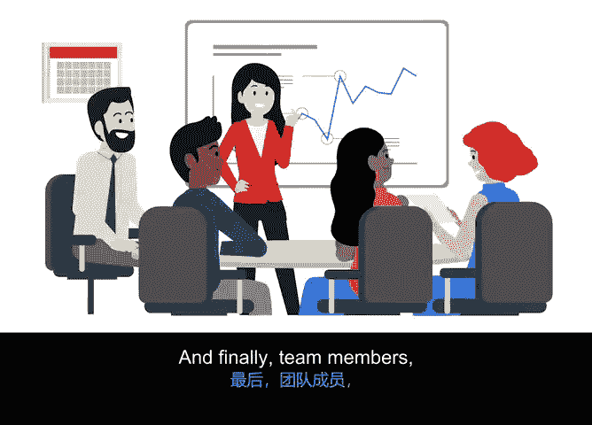

# 023：成功启动项目

## 🎯 概述
在本节中，我们将学习一个名为RACI责任矩阵的实用工具。该工具用于定义项目成员的角色与职责，以确保工作高效完成。我们将了解其构成要素、创建步骤以及它如何帮助预防项目中的常见混乱。

## 📊 从利益相关者分析到职责定义
上一节我们介绍了利益相关者分析，它帮助我们了解如何与各方协作以及何时沟通。本节中，我们来看看另一个便捷工具——RACI责任矩阵。

RACI责任矩阵帮助定义个人或团队的角色与职责，以确保工作高效完成。它能创建清晰的角色定位，并为每位团队成员提供明确的工作方向。

## 🔤 RACI矩阵的四要素
RACI矩阵包含四种参与类型，分别是：**执行者**、**问责者**、**咨询者**和**知情者**。我们来逐一了解。

*   **执行者** 指实际执行任务、完成工作的人。
*   **问责者** 指确保工作得以完成的人。
*   **咨询者** 指提供反馈的人，例如主题专家或决策者。
*   **知情者** 指仅需要了解最终决定或任务完成情况的人。

下图展示了这四种类型在图表中的分解形式。

## 📝 如何创建RACI矩阵
以下是创建RACI矩阵的步骤。

首先，思考谁参与了项目。将角色或人名写在图表顶部的行中。**专业提示：使用角色而非具体人名，特别是当某些人可能承担多个角色时。**

接下来，在左侧列中写下任务或交付成果。此处无需过于详细，目的是让图表简洁易读。

之后，逐一审视每项任务和交付成果，并提问：谁负责执行这项工作？如果工作未完成，谁将被问责？谁会有重要意见需要被咨询？谁需要被告知进展或相关决策？

根据你的答案，分配字母 **R**、**A**、**C** 和 **I**。

## 💡 应用示例
例如，作为Office Screen新服务发布项目的经理，你的任务之一是为不同的套餐和配送频率制定不同的价格点。

*   财务主管将是**问责者**，因为项目需要控制在预算内并实现盈利。
*   但**执行者**是财务分析师，因为他们是实际进行工作、确定最优定价的人。
*   产品总监将作为**咨询者**参与此事，因为他们负责监督产品供应。
*   最后，销售团队等成员需要被**告知**最终定价。

## ⚠️ 避免角色混淆
可能会有多个角色落入“知情者”和“咨询者”类别。但有一点始终不变：**被指定为“问责者”的人永远不会超过一个**。这避免了混淆，因为明确一人问责即明确了所有权归属。不过，同一个人可能同时是“问责者”和“执行者”。

还有其他几个因素可能导致角色混淆。例如：
*   **工作量不均衡**：意味着团队中有些人可能比其他人做更多或更少的工作。
*   **层级不清晰**：当任务未完成时，人们不确定该向谁寻求帮助。
*   **决策所有权不明确**：人们不确定谁对项目拥有最终决定权。
*   **工作重叠**：当团队或个人感觉他们对同一项工作负责时，情况会迅速变得混乱。
*   **过度沟通**：沟通通常是好事，但过多沟通反而会使事情复杂化，导致信息过载，使人们不知该关注什么，从而错过重要信息。

## ✅ 总结
本节课我们一起学习了RACI责任矩阵。我们了解了它的四个核心要素（执行者、问责者、咨询者、知情者），掌握了创建矩阵的步骤，并通过实例看到了它的应用。最重要的是，我们认识到，通过预先主动进行RACI分析，可以有效解决甚至预防项目中因角色职责不清而导致的各种混乱，从而为项目的成功奠定基础。