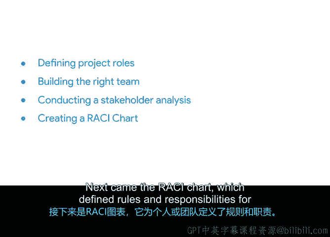

# 025：成功启动项目》｜项目启动总结回顾 🎯

在本节课中，我们学习了项目启动阶段的关键工具和概念，这些工具能帮助你组建高效团队并明确各方职责。接下来，我们将对所学内容进行系统回顾。

## 模块完成与内容概览 👍

恭喜你完成了又一个模块的学习。本节涵盖了许多对你而言可能全新的主题。

## 核心工具回顾

上一节我们介绍了项目启动的整体框架，本节中我们来具体回顾几个核心工具及其应用。

### 项目成功的关键问题

作为项目经理，你需要向自己提出关键问题以确保组建成功的团队。以下是需要考虑的核心方面：

*   **团队规模**
*   **必要技能**
*   **人员可用性**
*   **团队动机**

### 利益相关者分析

完成利益相关者分析有助于你理解如何管理与项目中每个人的沟通。

### RACI矩阵

接下来是RACI矩阵，它用于定义个人或团队的规则与职责。这能帮助团队高效完成工作，并为每位成员划定清晰的工作范围和操作指引。

RACI矩阵通过分配以下四种角色来实现这一目标：

*   **负责**：具体执行任务的人。
*   **问责**：对任务最终结果负责的人。
*   **咨询**：提供意见或信息的人。
*   **知会**：需要被通知进展的人。

## 工具价值与展望 📈

总的来说，你学习了一些非常实用且具体的工具，帮助你在整个项目期间保持条理。你可以与利益相关者协作时使用这些图表。如果你的项目处于持续演进中（有些项目确实如此），利益相关者分析和RACI矩阵将帮助你掌控任务并进行有效沟通。

在下一个模块中，你将学习其他用于管理项目的实用资源，并了解如何在特定情境下选择合适的工具。

## 课程总结

本节课中，我们一起学习了项目启动阶段的核心工具：通过关键问题评估团队组建，利用利益相关者分析管理沟通，以及运用RACI矩阵明确角色与职责。掌握这些工具将为你的项目管理实践奠定坚实基础。我们下节课再见。