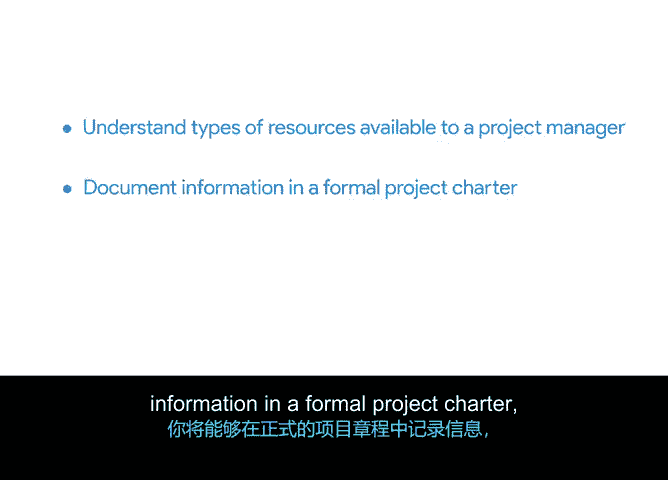

# 026：26_04_01_引言-运用资源和工具实现项目成功

欢迎回来，并祝贺你完成了上一个模块的评分评估。

## 概述

在本节课中，我们将要学习项目工具与资源，以及文档的价值。课程结束时，你将能够理解项目经理可用的资源类型，能够在正式的项目章程中记录信息，并能够比较和使用各种项目管理工具。

## 回顾与过渡

在之前的模块中，你学习了所有关于项目角色和职责的知识。我们还向你介绍了一些可用于确保团队责任制的工具，例如**干系人分析**和**RACI矩阵**。

接下来，我们将讨论项目工具和资源以及文档的价值。

准备好开始了吗？我们在下一个视频中见。

## 总结

本节课我们一起回顾了项目角色与职责工具，并概述了即将学习的核心内容：项目资源、工具以及项目章程文档的运用。