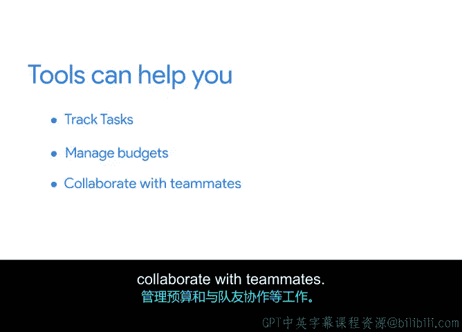

# 027：关键项目资源

在本节课程中，我们将学习如何识别和管理项目所需的关键资源。理解资源需求对于实现项目目标至关重要。

到目前为止，你已经学习了如何确定项目目标和范围，以及如何识别正确的项目相关方。

现在，是时候加入另一个重要成分：资源。作为项目经理，理解你的资源需求对于实现目标至关重要。因此，在启动阶段，你需要问自己：为了完成项目，我们还需要获取哪些东西？

项目资源通常包括**预算**、**人员**和**材料**。在思考项目目标和范围时，你将使用工具来管理所有这些资源，并找出实现这些目标所需的不同资源。

在项目开始前确定资源非常重要。这能让团队中的每个人更容易完成他们的工作。这是你作为项目经理的职责。你不会直接完成工作，但你会支持那些完成工作的人。早期确定资源也有助于你避免项目人员配置不足，这可能会严重拖慢团队进度并侵蚀整体时间线。更糟糕的是，如果你在资源规划上不够谨慎，最终可能会低估预算，意味着你可能没有足够的资金购买必要的材料、雇佣供应商或支持加班请求。早期规划资源是为团队成功奠定基础的绝佳方式，因为当你的队友拥有按时、按预算完成工作所需的一切时，他们就能更好地实现项目目标。

现在，我们来分解一下项目经理通常需要处理的一些资源。

首先，我们来谈谈预算。**预算**是完成项目所需资金数额的估算。几乎所有项目都有预算，因为它们需要资金来支付费用，例如购买正确的材料或软件、雇佣供应商来完成工作，或在项目完成后进行营销。在启动阶段，你需要与相关方和项目工作人员沟通，以确定完成项目所需的任务。在这里，你可能会提出一些问题来帮助发现隐藏成本。例如，你需要考虑产品上的任何税费吗？额外费用呢？所有这些信息都将帮助你创建预算，你可以用预算来寻找和比较供应商的提案，确定即将发生的成本，并跟踪流入和流出项目的所有资金。预算通常包含在项目章程中，并由相关方审查批准。我们将在后面讨论创建项目预算和项目章程时，更详细地介绍相关内容。

当我们谈论资源时，我们也在谈论帮助执行项目任务的**人员团队**。例如，你作为项目经理，就是一种资源。为这个新产品制作广告的营销经理也是一种资源。其他资源还可以包括公司外部的人员，他们拥有独特的技能，可以完成你组织内部人员无法亲自完成的特定任务。

然后是**材料**。这些是帮助完成项目所需的物品。例如，项目材料可能包括完成建筑项目所需的木材。

好的，现在你知道项目资源包括预算、人员和材料。你如何组织这些资源？这正好引出了我们的下一个主题：工具。

**工具**是使项目经理或团队更容易管理资源和组织工作的应用程序。它们帮助你完成诸如跟踪任务、管理预算以及与队友协作等工作。

市面上有各种各样的工具，包括像 Google Docs 这样的生产力工具和像 Asana 这样的工作管理软件。我们将在本课程的后面部分更多地讨论这些工具。工具对于跟踪进度至关重要，因此你需要在项目的所有阶段都将它们牢记在心。

让我们以 Office Green 为例，谈谈在项目启动阶段如何确定你的资源。提醒一下，Office Green 的植物服务为客户提供小型、低维护的植物，如仙人掌和多叶蕨类植物，客户可以将其放在办公桌上。客户可以在线或通过印刷目录订购，Office Green 会将植物直接运送到客户的工作地址。

项目目标是**将收入增加 5%**。那么你如何开始？你可以做一些研究来确定推出新植物服务的成本。这可能包括开发新网站和新宣传材料的估计价格，以及运输和交付成本。你可能还需要为特定工具做预算，例如帮助你跟踪这个复杂项目进度的项目管理软件。有了这些信息，你就可以开始制定一个现实的预算。你还需要弄清楚谁将和你一起参与这个项目。为此，你可以列出将帮助完成所有项目任务的人员和外部供应商。例如，负责与客户沟通的人员，或者可以提供产品的新植物供应商。

很好。希望你现在对所需的资源类型有了更深入的了解，这些资源不仅是为了完成工作，也是为了实现你的项目目标。在下一个视频中，我们将讨论文档，这是任何专业项目管理者的另一个重要主题。