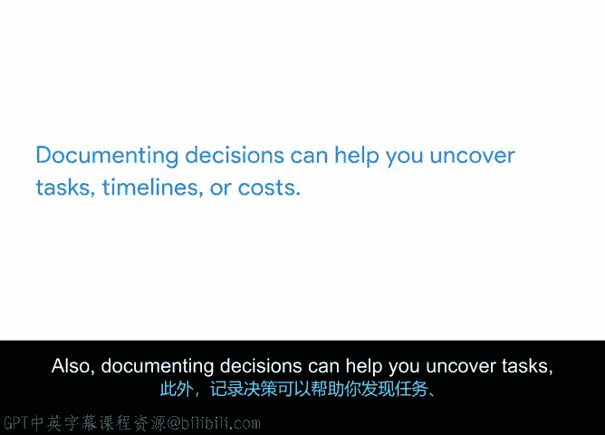

# 028：项目文档的价值 📄

在本节中，我们将探讨项目文档在项目管理中的核心作用。你将了解为什么文档记录至关重要，以及它如何帮助团队保持信息透明、决策清晰，并为项目的成功奠定基础。

---

现在你可能已经注意到，项目管理的很大一部分工作是引导决策制定。即使你不是项目重大方面的最终决策者，你的职责仍然是跟踪每一个新决策，并利用这些决策来制定计划。正如你所了解的，需要跟踪的重要决策非常多。这包括从确定项目目标和交付成果，到选择合适的人员加入团队等所有事项。任何一个人都难以仅凭记忆来跟踪所有这些信息。

这些信息对团队中的每个成员都很重要，而不仅仅是项目经理。如果一个决策影响到团队成员的任务，他们需要知晓，对吗？这就是为什么文档记录是项目经理角色的一个重要组成部分。虽然你的团队可能深入负责项目的特定领域，但你可能是团队中唯一一个了解并沟通项目所有不同领域的人。清晰且一致的文档可以确保透明度和清晰的沟通。

文档为项目奠定了基础。它传达了关键问题的答案。例如：你要解决什么问题？项目目标是什么？范围和交付成果是什么？项目相关方是谁？最后，团队完成工作需要哪些资源？对于任何参与项目工作的人来说，无论其角色如何，这些都是至关重要的信息。

文档还有助于保存项目早期做出的决策，并可以作为在项目生命周期后期加入的团队成员的参考点。你的职责是确保通过某种正式文档（如电子邮件、演示文稿或数字文档）可以轻松获取这些信息。此外，记录决策可以帮助你发现之前未考虑到的任务、时间表或成本。

最后，这个过程提供了一个历史记录，可以在项目结束时进行回顾。你可以将学到的经验教训应用于未来。

---

上一节我们介绍了项目文档的总体价值，接下来让我们看看几种具体的文档类型。以下是两种可以在项目早期为你奠定成功基础的关键文档：

*   **项目提案**：这是一份用于获取项目批准和资源的初步文件。它通常概述了项目的商业案例、目标和高层计划。
*   **项目章程**：这是一份正式授权项目并授予项目经理使用组织资源权力的文件。它明确了项目的目标、范围、主要相关方和高级别风险。

---

在本节中，我们一起学习了项目文档的核心价值。我们了解到，文档不仅是记录决策和计划的工具，更是确保团队信息透明、沟通顺畅以及为项目保留历史知识的关键。接下来，我们将深入探讨项目提案和项目章程这两种具体的启动文档。