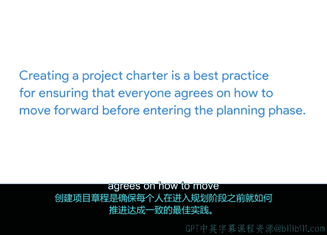

# 029：项目提案与章程基础 📄

在本节课中，我们将学习项目启动阶段的两份关键文档：项目提案与项目章程。我们将了解它们各自的定义、目的、区别以及核心作用，为成功启动项目奠定基础。

上一节我们讨论了文档记录与有效项目管理的价值。本节中，我们来看看两种用于记录细节并让相关方知情的常见文档类型：项目提案与项目章程。

## 项目提案

项目提案是一种在项目最早期出现的文档。这份文档的目的是说服相关方，项目应该启动。通常，由组织的高级领导者创建提案。因此，你可能无需担心创建提案，但需要跟踪提案的进展。项目提案是帮助你理解期望目标和影响的一个绝佳起点。提案可以是一份正式文件、一次演示，甚至是一封简单的电子邮件，目的是让他人接受这个想法。

## 项目章程

项目章程则是一份更详细的文档，它明确定义了项目，并概述了实现其目标所需的必要细节。项目章程帮助你组织起来，为需要完成的工作建立框架，并将这些细节传达给他人。

## 项目提案与章程的区别

那么，这些文档有何不同？项目提案在项目生命周期中出现的时间早于项目章程。提案通过影响和说服公司推进项目，从而启动项目启动阶段。项目章程有类似的目的，但通常出现在启动阶段的末尾。然而，它的目标是更清晰地定义项目的关键细节。这两份文档的另一个区别在于，章程通常会在项目的整个生命周期中作为参考点，而提案仅在最早阶段使用。

现在你知道了这两份文档的区别，让我们更深入地了解一下项目章程，你将在本模块中了解更多关于它的内容。

## 项目章程的核心作用

项目章程明确了项目的收益大于成本。正如你在本课程前面所学到的，在进行成本效益分析时，你可能会问自己几个问题。这些问题包括：
*   这个项目将创造什么价值？
*   这个项目能为我的组织节省多少钱？
*   人们需要在这个项目上花费多少时间？

你将在章程中包含这些问题的答案。这类信息确保你与相关方就项目价值达成一致。章程还有助于确保你与相关方就项目细节达成共识。项目章程的批准意味着管理层支持该项目，它也是确保项目符合组织需求的关键一步。在相关方和项目发起人审查并批准项目章程后，你就获得了推进项目的授权。

## 项目章程的格式与内容

项目章程可以有几种格式，并可能包含不同的信息，具体取决于项目和组织。章程中的信息也可能根据其受众或特定相关方的需求进行调整。例如：
*   如果你正在为一位营销高管相关方撰写项目章程，章程可能包含关于项目将如何影响组织品牌的信息。
*   如果相关方是首席技术官，章程可能包含关于维护项目所需工程资源成本的信息。

无论格式或受众如何，项目章程都是一项最佳实践，确保每个人在进入规划阶段前就如何推进达成一致。

## 项目章程的动态性

项目章程是一份动态文档。这意味着它可以随着项目的进展而演变。作为项目经理，你将在整个过程中审查和完善章程。

现在你更了解了项目章程的价值，是时候学习如何创建一份章程了。让我们在下一个视频中开始学习。

---

本节课中，我们一起学习了项目启动阶段的两份核心文档。项目提案用于说服相关方启动项目，而项目章程则更详细地定义了项目目标、细节与价值，并获得正式授权。章程是一份动态文档，将在项目过程中不断被审视和更新，是确保项目与组织目标一致并顺利推进的关键基础。