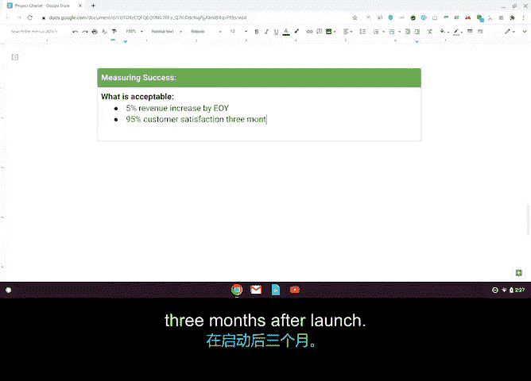

# 030：制定项目章程 📄

## 概述
在本节课程中，我们将学习如何制定一份项目章程。项目章程是启动项目的关键文件，它有助于获得利益相关者的批准，并为项目奠定基础。我们将使用一个类似谷歌项目经理常用的模板，并以“Office Green”公司的“Project Plant P”项目为例，逐步填充每个部分。

---

## 项目章程的结构与填写

上一节我们讨论了项目章程的价值。本节中，我们来看看如何具体创建一份章程。

### 项目名称与摘要
首先，在章程顶部填写项目名称和简要摘要。

*   **项目名称**：Project Plant P
*   **项目摘要**：我们的计划是为高价值客户提供小型、低维护、能在办公室环境中茁壮成长的植物。

### 项目目标
接下来，填写项目目标部分。请记住，目标应符合**SMART原则**（具体的、可衡量的、可实现的、相关的、有时限的）。

以下是“Project Plant P”的目标：
*   通过在年底前推出一项为顶级客户提供办公室植物的新服务，将收入提高5%。

### 项目交付成果
现在添加项目交付成果。交付成果是项目产生的**有形成果**。

本项目的交付成果包括：
*   向100位客户送出1000株植物。
*   推出用于下单和客户支持的新网站。

### 商业论证与成本效益分析
商业论证部分阐述了启动项目的理由。它通常由成本效益分析支持。

*   **商业论证**：这是客户最常请求的服务之一，也将提高客户满意度和留存率。
*   **成本效益分析**：
    *   **效益**（预期收益）：提高客户满意度；增加收入。
    *   **成本**：包括采购产品的价格、开发网站和营销材料的费用。我们在此填入**$250,000**作为预估预算。

请注意，以上是用于教学基础的简化示例。在实际项目中，你需要进行更详细的分析来确定效益和成本。关键要点是：**效益应始终大于成本**。

### 项目范围
现在，添加项目范围，以及明确哪些内容被视为超出范围。

范围是项目包含或不包含内容的共识。明确范围有助于项目团队集中精力。

*   **范围内事项**：创建一项服务，向去年的顶级客户递送小型植物。
*   **范围外事项**：植物送达后的养护服务。

### 项目团队与利益相关者
以下是项目的主要参与人员。

**项目团队**：
*   **项目发起人**：Office Green 产品总监。
*   **项目负责人**：你（项目经理）。
*   **项目团队成员**：可能包括市场专员、网站开发人员和外部植物供应商等。

**其他利益相关者**：
*   客户成功副总裁（负责客户反馈和相应的产品请求）。
*   客户经理（利用与顶级客户的现有关系）。
*   履约经理（帮助获取启动服务所需的植物）。

### 成功衡量标准
最后，定义如何衡量项目的成功。

我们设定的成功标准是：
*   到年底实现收入增长5%。
*   在服务推出三个月后，客户满意度达到95%。

---

## 总结
本节课中，我们一起学习了如何制定一份完整的项目章程。你看到了文档如何构成项目的根基，并如何促进项目的最终成功。就像培育植物一样，你正在学习如何培育一个项目，以确保它达到最佳状态。下一节，我们将讨论项目经理用来指导团队并确保任务完成的工具。