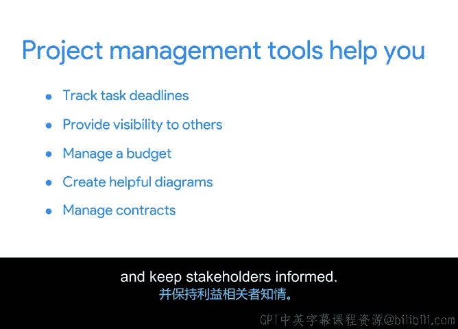

# 031：运用工具实现高效项目管理 🛠️

在本节课中，我们将探讨项目管理工具的重要性，以及如何根据项目需求选择合适的工具。我们将了解工具如何帮助项目经理跟踪进度、促进沟通，并提升整个项目的可见性与透明度。

## 为什么工具至关重要

上一节我们介绍了项目启动的基础，本节中我们来看看工具在其中的核心作用。作为项目经理，工具是您可支配的最有帮助的资源之一。它们对于跟踪进度至关重要，因此在整个项目周期中将其置于首要位置非常重要。

工具是使项目经理或团队更易于管理资源和组织工作的辅助手段。它们之所以有用，是因为可以帮助您跟踪各类任务的详细信息，并便于与众多不同的人员进行沟通。请记住，有效的沟通和跟踪是项目经理日常职责的重要组成部分。

试想一下，如果没有电子邮件或在 Google Docs 或 Microsoft Word 中创建的数字文档等协作工具的帮助，您的工作会变得多么困难。

## 工具的实际应用场景

让我们在 Office Green 公司的项目背景下想象一下。作为首席项目经理，您掌握了大量关于公司向顶级客户提供办公室友好植物计划的信息。但如果您将每个项目细节都写在白板上，而不是共享的在线文档中，会发生什么？

以下是可能出现的情况：
*   您的团队成员必须到您的办公桌前才能获取最新信息。
*   这绝对不是对任何人时间的最有效利用。

但是，如果您将这些信息存储在易于访问的在线文档中，您就为团队中的每个人节省了时间、精力，并避免了一个大麻烦。

## 工具带来的核心优势

当今的工具让我们与队友共享信息变得容易得多。更好的是，借助项目管理工具，信息共享是双向的。这意味着团队成员也可以轻松地向您更新他们的进度，而无需额外的会议或电话。这非常棒。

当您为项目选择合适的工具时，可以让队友轻松地告知您任务是否按计划进行或是否延迟，从而使您能够快速了解任何变更可能如何影响项目的其余部分。

项目管理工具提高了包括利益相关者在内的每个人的可见性和透明度。您可以使用各种工具来完成许多不同的事情。

以下是工具能帮助您完成的主要任务：
*   **跟踪进度**：跟踪任务、可交付成果和里程碑的进度。
*   **管理预算**：帮助您管理项目预算。
*   **可视化数据**：构建有用的图表和图解。
*   **管理文书**：管理合同和许可证。
*   **保持沟通**：让利益相关者随时了解情况。

## 如何选择合适的工具

工具可以很简单，如数字电子表格或文档；也可以更复杂，如日程安排和工作管理软件。在选择使用哪种工具时，考虑项目的需求非常重要。

需要记住的一点是，如果您选择了一个更复杂的工具，您的队友和利益相关者将需要一些时间来熟悉它。对于小型项目，这可能带来的麻烦大于其价值。因此，对于小型项目，一个简单的工具可能更有效。

但如果项目范围很大，那么团队花时间学习并最终使用更复杂的项目管理工具可能是值得的。您还应该记住，有时您无法选择所使用的工具类型。如果组织已经决定使用特定工具，那么您就需要使用他们提供的工具。这完全关乎保持灵活性。

## 总结与展望

您是否开始明白如何运用工具来保持项目正轨？无论工具是简单还是复杂，它们都有助于您更有效地进行沟通和管理。

本节课中，我们一起学习了项目管理工具的核心价值、应用优势以及根据项目规模和需求进行选择的策略。关键在于利用工具提升效率、透明度和协作。

接下来，我们将介绍一些用于有效项目管理的最常见工具类型。我们下一节见。