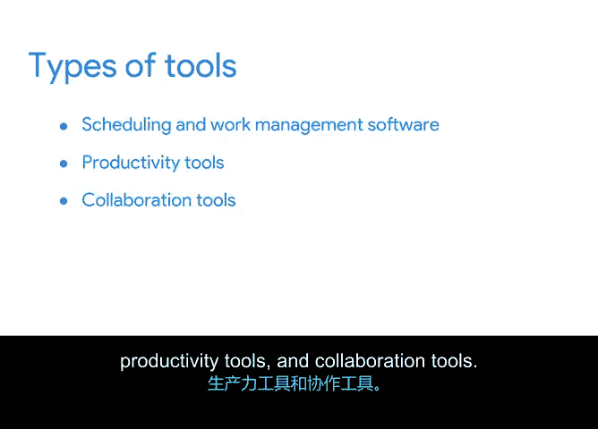

# 032：项目管理工具类型探索 🛠️

在本节课程中，我们将学习项目管理中使用的不同类型工具，了解它们如何帮助你更有效地工作。我们将重点介绍日程安排与工作管理软件、生产力工具以及协作工具。

你已经了解了工具如何提升工作效率。现在，我们来深入了解项目管理中使用的不同工具类型。

## 日程安排与工作管理软件 📅

日程安排与工作管理软件是常见的工具类型。市场上有多种不同类型的工作管理软件，包括一些流行的工具。

根据项目具体情况，某些工具可能更适合你的项目。例如，这取决于你采用的项目方法论，或者涉及的任务数量和人员规模。

那么，为何要选择使用日程安排与工作管理软件呢？这类软件在向多位团队成员分配任务以及跟踪工作进度方面非常有用。它还能帮助你直观地了解团队的进展。

例如，如果你使用工作管理软件来分配和跟踪任务，当你的团队在一周内完成了50个任务，而下一周只完成了3个任务时，你更有可能注意到这个情况。这是一个明确的信号，表明你需要检查是否存在阻碍进展的问题。如果你没有跟踪他们的任务，可能就不会发现这个问题。这正是工作管理软件如此有用的部分原因。它提供了项目进展的概览，让你知道何时需要与团队沟通，以使任务重回正轨。

## 生产力工具 📈

接下来我们将讨论的另一类项目管理工具是生产力工具。生产力工具对你和你的团队非常有帮助。

这包括文字处理工具，如 Microsoft Word 或 Google Docs。你可以使用这些工具与团队创建共享文档，例如我们之前教你如何填写的项目章程。你也可以使用这些工具来创建会议议程和状态更新等文档，我们将在后续课程中详细讨论。

电子表格是另一种有用的生产力工具。它们用途广泛，可以用来制作燃尽图、项目计划以及其他有用的图表，这些内容也将在后续课程中详细介绍。

使用 Microsoft PowerPoint、Keynote 或 Google Slides 等工具创建的演示文稿，是以视觉化、易于理解的方式呈现项目的好方法。

## 协作工具 🤝

现在，我们来讨论协作工具。你可能需要依赖这些工具来与队友紧密合作。

这些工具包括你可能熟悉的电子邮件和聊天工具。这类工具可以帮助你快速、高效地就项目相关的问题、评论和其他主题进行沟通。

像文档和电子表格这样的生产力工具，以及像电子邮件和聊天这样的协作工具，都相当简单。这意味着它们非常适合任务较少、团队成员不多、需要跟踪事项较少的小型项目。

而对于任务数量更多、团队规模更大的大型项目，日程安排与工作管理软件则更为合适。

很好，你已经了解了可用的工具类型，包括日程安排与工作管理软件、生产力工具和协作工具。

在下一个视频中，我们将更深入地探讨一些最流行的项目管理工具。我们下个视频见。