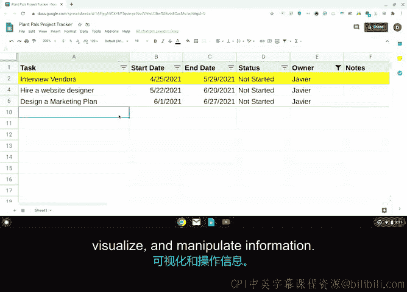

# 033：常用项目管理工具 🛠️

在本节中，我们将介绍几种常用的项目管理工具，帮助你理解如何利用软件来规划、跟踪和协调项目工作。掌握这些工具的基本知识，将为你未来的项目管理实践打下坚实基础。

## 工具概述

上一节我们介绍了不同类型的项目管理工具，从日程安排和工作管理软件到生产力和协作工具。本节中，我们来看看几种你可能会用到或至少应该熟悉的流行工具。

有许多不同类型的工作管理软件，它们能自动简化项目规划与跟踪，比手动跟踪高效得多。

## 重点工具介绍

以下是本课程将重点介绍的两个工具。

### Asana：工作管理平台

Asana 是一个工作管理平台，帮助团队规划和协调工作，范围涵盖日常任务到战略计划。

Asana 提供了一个动态系统和一个“唯一事实来源”，所有工作都集中于此。在 Asana 中，每个人都可以查看、讨论和管理团队的优先事项，让团队清楚地了解**谁在何时做什么**。它非常适合用于：
*   制定项目计划。
*   分配任务。
*   自动化工作流程。
*   跟踪进度。
*   与相关方沟通。

作为项目经理，你可以使用 Asana 创建任务日志（例如，收集外部供应商的成本估算），并将任务分配给团队成员。

所有任务都以项目经理选择的格式（如列表或日历）清晰可见并组织有序，旨在推动透明度，并将所有任务与总体目标联系起来。

Asana 也易于与外部相关方协作，因为你可以在平台内与公司外部人员共享状态更新和其他沟通信息。

### 电子表格：多功能工具

本课程将关注的另一个强大工具是电子表格。

电子表格功能极其多样，可用于广泛的任务，从创建时间线和构建图表，到管理预算和跟踪任务。

你可以根据需要，以多种格式添加和查看项目信息。

例如，假设你在电子表格中输入了任务列表、截止日期、完成状态和任务负责人。之后，你可以轻松地按截止日期排序列表，以查看接下来要完成的任务。

你还可以按任务负责人筛选任务列表，从而只看到你负责的事项。

此外，你可以用不同颜色高亮显示表格中的行，以直观地展示进度最慢的任务。

借助电子表格，你可以轻松地转换、可视化和处理信息。

## 工具选择与适应

电子表格和 Asana 这类更全面的工具只是有效项目管理的两个选项。了解市面上各种软件的基本功能是一个好主意。

这样，如果你的公司没有标准的软件工具，你可以根据项目需求选择或推荐合适的工具。

在项目初期，能够为工作推荐合适的工具，是为团队增值的好方法。

但请记住，软件选项在不断变化，从新功能的增加到新工具的发布。你不可能了解所有可用软件，也没有公司会这样要求。

许多工具具有相似的功能，例如任务跟踪和任务分配。因此，如果你深入理解了一个工具，就应该能够轻松适应工作中的新工具。

## 探索与实践

现在你已经对 Asana 和电子表格的功能有了更多了解，请花些时间探索这些工具，因为我们将在后续课程中使用它们。

接下来，你将听到一位项目经理的分享，他将详细介绍在谷歌日常工作中使用工具的经验。敬请关注。😊

## 本节总结

本节课中，我们一起学习了两种常用的项目管理工具：**Asana工作管理平台**和**多功能电子表格**。我们了解了它们的基本用途、核心功能以及如何根据项目需求选择和适应不同的工具。掌握这些工具将帮助你更高效地规划、执行和跟踪项目。