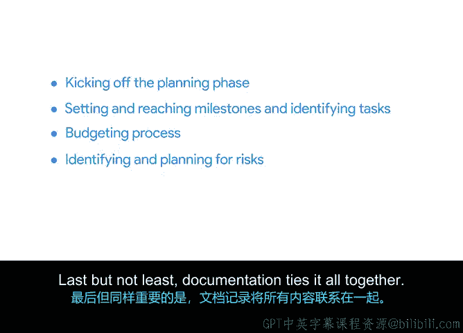

# 001：将一切整合起来

在本课程中，我们将学习项目管理的规划阶段。我们将探讨如何启动规划、设定里程碑、分解任务、管理预算、识别风险以及进行项目文档化。这些技能对于确保项目成功至关重要。

## 课程简介

上一节我们介绍了本课程的整体目标，本节中，我们来认识一下本课程的讲师。

大家好，欢迎来到名为“规划：将一切整合起来”的课程。

如果你已经完成了我们之前的课程，那么你已经为启动项目和开启规划阶段打下了坚实的基础。

在开始之前，让我介绍一下自己。我叫罗威娜，将是本课程的讲师。我在谷歌云担任高级项目经理，负责各种项目。我的工作主要专注于为我的团队进行系统和生产力提升。我的团队由大约100名全职员工和全球300多名合同工组成。我参与的一些大型项目影响着谷歌云销售和全球销售支持团队，这些团队由数千人组成。

但我并非一开始就在全球性公司为数千人构建解决方案。我17岁离开学校，没有大学学位，也没有明确的计划。在加入谷歌之前，我曾在零售、酒店甚至航空业担任空乘人员。当我进入企业界时，我注意到了一些事情：那里的流程和我工作过的零售店仓库一样混乱，有很大的改进空间。我逐渐意识到，每个企业都很复杂，总有创造秩序的空间。

于是我开始思考如何自动化我的日常任务。我通过电子邮件向经理和同事提出想法，与公司内外的团队合作，集思广益解决问题，协调同事的培训等等。就在那时，事情变得清晰起来：我正在做项目管理。

我转到了谷歌位于加州山景城总部的一个完全专注于项目管理的职位。在我的工作面试中，我重点介绍了如何将之前角色中可转移的技能应用到新工作中，以及如何利用从经验中获得的知识。四年后，我站在这里，非常高兴能与你们一起踏上这段学习旅程。

从外部看，大型全球公司似乎一切都已安排妥当，但总有引入新流程的空间。你很可能从之前的经历中获得了有用的技能和见解。所以请继续前进，你正朝着正确的方向前进。

## 课程核心内容

上一节我们认识了讲师并了解了她的背景，本节中我们来看看本课程将具体涵盖哪些核心内容。

本课程的重点是规划阶段。我将分享完成此阶段所需的工具和技术。

首先，我将演示如何启动规划阶段。然后，我们将探讨设定和达成里程碑的重要性。对于每一个里程碑，都有一系列任务需要完成。因此，我将教你一些分解和分配工作量的技巧。

之后，我们将讨论预算以及整体预算流程是如何运作的。我们将了解组织外部可能对预算决策起作用的人员或公司。我们还将讨论充分记录预算的重要性。

接着，我们将讨论各种风险以及这些风险可能对项目产生的影响。事情永远不会完全按计划进行，但风险管理是确保你知道可能出现什么问题以及如何应对的好方法。这包括向利益相关者传达可能的风险、制定缓解计划，然后密切关注这些风险，确保它们不会破坏你的项目。

最后但同样重要的是，文档将所有内容整合在一起。保持所有项目计划的记录和组织不仅对你有帮助，也能让参与者了解他们的职责。文档还为利益相关者提供了一个了解项目进展的窗口。这对于我在谷歌自己项目的成功一直非常重要，我很高兴能与你们一起探讨这个话题。

## 总结

本节课中，我们一起学习了“项目规划：将一切整合起来”课程的概述。我们认识了讲师罗威娜，了解了她的职业背景和项目管理理念。我们也预览了本课程的核心模块，包括启动规划、设定里程碑、任务分解、预算管理、风险识别与应对以及项目文档化。准备好开始了吗？我们下个视频见。