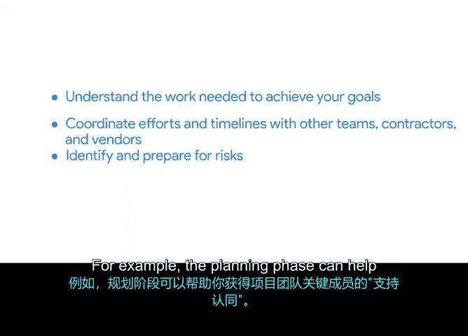

# 002：项目规划的优势

在本节课中，我们将要学习项目规划阶段的重要性及其带来的诸多好处。我们将探讨规划如何帮助团队明确目标、协调资源、识别风险，并最终为项目的成功奠定坚实基础。

大家好。在之前的课程中，我们学习了项目启动阶段。在启动阶段，项目经理需要收集所有必要的初步信息，以获得利益相关者的批准并为项目制定计划。

在此期间，有几件关键事项需要完成。首先，项目经理被任命。这个人就是你。然后，项目的目标、范围及其可交付成果必须获得批准。需要为项目分配一定数量的人员。你需要清楚地了解他们各自的角色和职责。你还需要利益相关者签署你的项目章程。

如果所有这些标准都已满足，那么你就可以开始规划了。

规划是确保项目成功的重要组成部分。因此，让我们花些时间讨论一下它为何如此重要。

规划对于任何项目都至关重要，无论项目大小。在规划项目时，你和其他团队成员将确定实现目标所需的流程和工作流，并集思广益，探讨如何使项目取得成功。

在规划过程中，你可以借鉴以往的项目经验，但也不要害怕思考新的方法来取得成果。每个项目都是不同的，因此新的、不同的方法可能正是你所需要的。

规划有许多好处。正如我们讨论过的，规划帮助你绘制出完整的项目蓝图。它帮助你理解实现目标所需的工作。规划还有助于与其他团队、承包商和供应商协调工作和时间表。

规划的另一个巨大好处是，它让你有时间识别并准备应对可能影响项目的风险。这些风险可能包括时间表的延迟、关键团队成员的离职，或者主要利益相关者对项目方向的改变。

规划也让你有机会集思广益，寻找减轻或应对这些风险的方法。

规划还有一些不那么明显的好处。例如，规划阶段可以帮助你获得项目团队关键成员的支持。获得支持意味着你已经赢得了他们对你的计划的支持。

规划还向利益相关者表明，团队正在谨慎地以一个详细的计划来启动项目。

但规划最重要的好处之一是团队协作。通过在规划阶段共同努力，团队协作将帮助你推动项目跨越终点线。在规划完成、工作即将开始时，分配到项目的个人可以成为一个强大的团队。

共同规划能在项目所有参与方之间建立共识。

因此，总结一下，规划有很多好处，从帮助团队理解实现目标所需的工作，到向利益相关者提供项目计划。

现在你对规划有了更多了解，接下来我们将学习如何启动规划阶段。我们下个视频见。