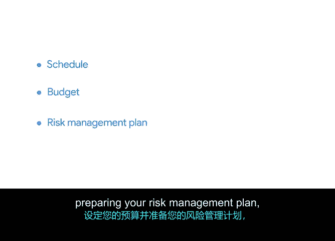

# 003：启动规划阶段 🚀

在本节中，我们将学习如何正式启动项目的规划阶段。我们将了解规划阶段的核心组成部分，并探讨为何这些元素对项目的成功至关重要。

上一节我们讨论了规划的重要性。本节中，我们来看看如何具体地启动规划阶段。正如之前所学，规划阶段是项目生命周期的第二个阶段。这对项目经理来说可能是一个充满挑战的时期，因为有太多需要考虑的因素。但重要的是要明白，项目计划并不需要在第一次就做到完美无缺。即使你第一次就制定了出色的计划，随着项目的推进，计划也很可能发生变化。

不同项目的规划阶段可能有所不同，但通常在此阶段需要确定三大事项：**进度计划**、**预算**和**风险管理计划**。我们将在课程后续部分更详细地讨论每一项。现在，我们先进行概括性了解，以便理解为何这三项对规划如此关键。

## 制定进度计划 📅

进度计划本质上是项目的时间线。它包括开始日期、结束日期以及中间各项任务的日期。你将使用时间估算技术来确定这些日期。

让我们以Office Green公司的“绿植伙伴”项目为例来设想一下进度安排。作为提醒，你是这个为顶级客户提供桌面友好型植物新服务的首席项目经理。你希望在今年年底前推出该服务。

因此，该项目的规划阶段应包含一系列关键日期。以下是可能包含的日期示例：
*   向植物供应商征求提案的日期。
*   与为服务创建新网站的网页设计师和开发人员启动合作的日期。
*   项目执行阶段的重要日期，例如植物需要备好待发的日期，或新网页设计需要获得批准的日期。
*   服务推出的目标日期。

## 设定预算 💰

规划阶段的另一部分是设定预算。预算将核算完成项目的总成本。总成本需要被分解，以确定项目不同要素需要花费多少。

对于“绿植伙伴”项目，预算需要包含以下项目：
*   设计和启动网页的成本。
*   雇佣植物供应商的成本。
*   以及其他更多费用。

## 准备风险管理计划 🛡️

规划阶段的第三个组成部分是风险管理，即寻找可能出现的问题并提前计划以减轻这些风险。我们必须面对现实：风险在每个项目中都不可避免。但风险对项目的影响并非不可避免。

良好的项目规划意味着寻找可能出现麻烦的地方。进度可能在何处偏离轨道？预算可能在何处超出你的估算？你将与团队合作，思考这些问题的答案，并根据你的发现准备一份风险管理计划。

让我们回到Office Green的例子。在制定初步进度计划时，你可能会意识到开发人员的估算将使项目远远超出原定的发布日期。为了管理这个风险，你可能会尝试缩减或调整项目范围以仍能赶上截止日期，甚至与利益相关者协商一个新的发布日期。这是两个关于如何减轻进度风险的简单例子。

## 本节总结

总而言之，你将在规划阶段构建你的**进度计划**、设定你的**预算**并准备你的**风险管理计划**。但首先，你需要让整个团队参与进来并达成共识。

下一节，我们将讨论项目启动会议，这是项目真正开始运转的地方。我们那里见。