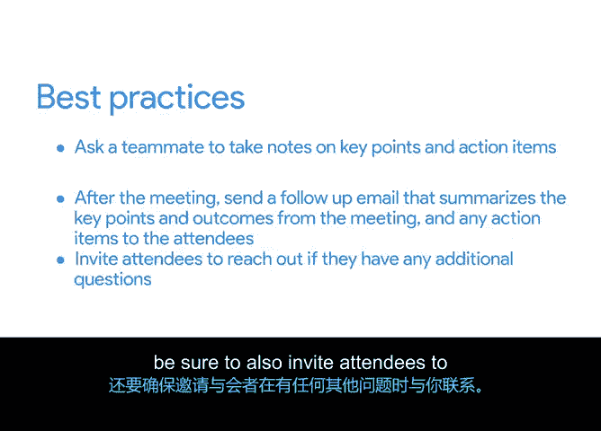

# 004：将一切整合起来

## 概述

在本节课程中，我们将学习如何筹备和召开项目启动会议。启动会议是项目规划阶段正式开始的标志，其核心目标是统一团队愿景、明确目标与范围，并建立协作基础。

---

## 04_01_03：促进项目启动会议 🚀

项目启动会议是项目团队首次正式集合的会议。其目的是让所有成员基于一个共同的愿景，对项目目标和范围达成共识，并理解每个人在团队中的具体角色。

### 为何需要启动会议？

你可能会想，团队成员是否可以从项目章程中了解所有必要信息，从而省去会议？虽然会议可能耗时，但对于涉及多人的大型项目，启动会议至关重要。它有助于建立共同愿景、就范围达成一致并培养团队默契。这也是团队成员提问和提供见解的机会，同时你可以借此设定每个人对项目贡献的期望。

### 如何规划与召开启动会议？

在线有许多启动会议议程模板，它们结构相似，通常持续约一小时。以下是一个建议议程结构，你可以根据项目和团队的具体需求调整每个环节的时间。

以下是启动会议的标准议程结构：

1.  **介绍（约10分钟）**
    会议以简短的介绍开始。让每位与会者介绍自己及其角色。如果时间允许，可以分享一个趣事以帮助建立团队默契。

2.  **项目背景概述（约5分钟）**
    介绍项目的来龙去脉及其重要性。利用这段时间设定共同的愿景。

3.  **目标与范围（约5分钟）**
    分享项目目标与范围。范围定义了项目的边界，需明确哪些工作属于范围内，哪些属于范围外。同时，分享目标发布日期并强调团队需要关注的重要里程碑。

4.  **角色与职责（约5分钟）**
    确保每个人都清楚自己在项目期间将负责的工作。

5.  **协作方式（约10分钟）**
    讨论团队将如何在项目上协作。可以介绍团队共享信息的工具（如在电子表格中创建的项目计划或像Asana这样的工作管理软件），并确定团队沟通方式（如每日邮件更新、团队聊天室、每周团队检查会议）。

6.  **后续步骤（约10分钟）**
    在讨论了项目细节后，与团队成员设定对后续工作的期望，并向每位成员明确他们接下来需要采取的行动。

7.  **问答环节（约15分钟）**
    为团队预留提问时间。这是团队澄清任何已讨论话题的机会，也是你听取团队意见、确保项目受益于多元化思想、经验和想法的机会。

### 会议筹备与后续工作

确定会议议程后，将其记录在会议议程模板中，并在会议前一两天发送给与会者。

作为项目经理，你将主导会议的大部分内容。由于在演示时难以同时做笔记，可以在会议开始时请一位同事记录讨论的关键点以及每位成员的行动项。

在某些情况下，录制会议可能有益，特别是对于大型或分散的团队，方便与会者日后回顾。务必提前获得每位与会者的录制许可。

会议结束后，别忘了向团队发送跟进邮件，总结会议的关键点、成果以及与会者的行动项。在跟进邮件中，还应邀请与会者如有任何其他问题可随时联系。

### 总结

启动会议涵盖介绍、项目背景、目标与范围、角色、协作以及后续步骤，并在最后预留团队提问时间。虽然启动会议涉及许多工作，但这对团队，尤其是对你作为项目经理而言，是一个激动人心的时刻。你在启动阶段所做的周密思考和辛勤工作将汇聚成项目的基础。

在接下来的视频中，我们将学习里程碑、任务以及它们之间的区别。