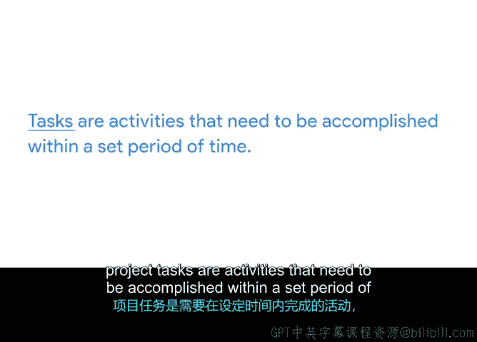

# 005：将一切整合起来

## 概述

在本节中，我们将学习项目管理中的两个核心概念：**项目任务**与**项目里程碑**。理解它们的定义、区别以及相互关系，对于有效分配工作、跟踪项目进度至关重要。

---

## 理解任务与里程碑 🎯

在之前的课程中我们了解到，项目经理负责为团队分配工作并跟踪项目进度。当讨论工作分配时，我们会用到几个关键术语：项目里程碑和项目任务。

下面我们来详细解析这两个概念。

### 什么是项目里程碑？

一个**项目里程碑**是项目时间表中的一个重要节点，它标志着进展，通常意味着一个可交付成果或项目阶段的完成。

里程碑是你项目中的关键检查点。跟踪它们有助于确保你的项目按计划实现目标。

以下是里程碑的两个例子：
*   完成报告的第一稿（其最终目标可能是发布该报告）。
*   获得客户对主要可交付成果的签字批准。

### 项目任务与里程碑有何不同？

一个**项目任务**是在规定时间内需要完成的具体活动。

项目的工作被分解为许多不同的任务。为了达到一个里程碑，你和你的团队必须完成多个任务。

例如，如果里程碑是“完成报告的第一稿”，那么达到该里程碑所需的任务可能包括：
*   聘请撰稿人。
*   进行研究。
*   起草报告的不同章节。

### 实践案例：Office Green 项目

让我们在 Office Green 公司“植物养护”项目的背景下想象一下里程碑和任务。

你的一个项目可交付成果是为新服务启动一个网站，客户可以在该网站下订单并获得客户支持。

在网站启动之前的一些里程碑将包括：
*   获得网站设计的批准。
*   根据用户测试反馈完成修改。

为了实现这些里程碑，你的团队需要完成多个项目任务。

例如，为了达到“设计批准”这个里程碑，你的网站设计师需要完成以下任务：
1.  创建拟议网站设计的初始模型。
2.  你需要审查这些模型。
3.  设计师需要根据你的反馈进行修改。

以上每一项都是一个**项目任务**，在它们全部完成之前，你无法达到**里程碑**。

---

## 总结

本节课我们一起学习了项目规划中的两个基础构件：
*   **里程碑**是项目时间表中的重要节点，标志着关键成果的完成。
*   **任务**是为达成里程碑而在规定时间内需要完成的具体活动。

里程碑与项目任务相互关联：**任务累积构成里程碑，而里程碑对于项目跟踪至关重要**。现在你已经更了解里程碑、项目任务以及两者的区别，我们将在下一个视频中进一步学习里程碑的重要性。