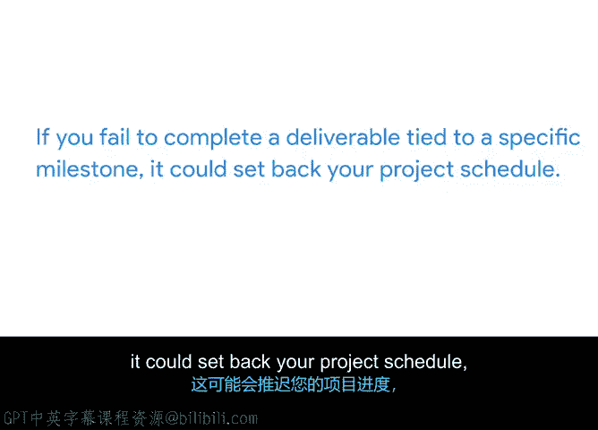

# 006：设定里程碑的重要性 🎯

在本节课中，我们将学习为什么在项目规划中设定里程碑至关重要。里程碑不仅仅是时间表上的标记，更是确保项目成功交付的关键工具。

上一节我们介绍了里程碑的基本概念，本节中我们来看看为什么设定里程碑如此重要。虽然直接列一个待办事项清单并开始执行项目看似诱人，但花时间将项目分解成一个个部分至关重要。

以下是设定里程碑的几个核心原因：

首先，设定里程碑能让你清晰地了解项目所需的工作量。设定里程碑的行为迫使你将项目分解成更易管理的部分。分解得越细，你就越能看清达成项目目标所需的具体工作。例如，乍一看，**启动一个新网站**似乎很简单。但实际工作量可能远超想象。如果你将这个交付成果分解为多个里程碑，再将里程碑分解为具体任务，你就能更准确地把握真实的工作量，从而更好地管理工作负荷。

其次，里程碑有助于保持项目按计划进行。当你设定一个里程碑时，你为特定的项目交付成果设定了明确的截止日期。在执行阶段，你可以回顾这些截止日期，以确保项目以正确的节奏推进。

第三，设定里程碑能帮助你发现可能需要调整范围、时间线或资源的领域。例如，如果你发现达成某个里程碑所需的任务比预期更多，你可以请求利益相关者批准缩减项目范围或减少任务数量。

最后，达成里程碑能极大地激励团队，并向利益相关者展示实际进展。对于持续数月的大型项目，保持团队高昂的士气很重要。里程碑标志着重要工作块的完成，为团队提供了庆祝的时刻。同时，里程碑也是向利益相关者汇报进展的绝佳检查点，让他们有机会看到已完成的工作，并确认一切都在正轨上且符合标准。

此外，必须记住里程碑需要按时并按顺序完成。因为通常，达成下一个里程碑依赖于前一个里程碑的完成。以“Office Green”公司的植物服务网站项目为例。为了启动网站，你需要达成几个里程碑，例如：**获得网站设计批准**、**完成网站开发**、**实施用户测试反馈**。这些里程碑必须按此顺序进行。原因在于：如果利益相关者未批准设计，网页开发人员就无法开始构建网站；如果没有可供测试的网站，你就无法实施用户测试的反馈。

按时达成里程碑同样重要。如果团队错过了与特定里程碑绑定的交付成果截止日期，就可能导致项目进度延误，这意味着团队可能需要加班或增加额外资源来追赶进度。例如，如果你需要在周五前获得利益相关者对网站设计的批准，但网页设计师尚未完成设计，你可能不得不等到周末之后才能获得批准。这将延迟开发阶段的启动，从而缩短团队构建网站的时间。更糟糕的是，如果完成此交付成果直接关联到客户的付款，这种延误还可能影响项目预算。如果错过截止日期，你很可能会延迟收到付款，甚至可能面临完全失去付款的风险。虽然截止日期有时可以灵活调整，但对于那些截止日期不可协商的里程碑，必须格外注意。

本节课中我们一起学习了设定里程碑的重要性。它帮助我们量化工作、跟踪进度、识别风险、激励团队，并确保关键交付成果按时按序完成。接下来，我们将讨论如何为你的项目设定具体的里程碑。