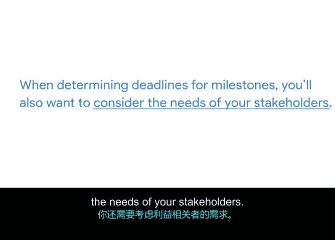

# 007：如何设定里程碑 🎯

在本节中，我们将学习如何为项目设定里程碑。里程碑是项目规划中的关键节点，它们能清晰地展示项目进展，帮助团队保持正轨，并向利益相关者汇报成果。接下来，我们将一步步了解如何识别和设定这些重要的检查点。

## 理解里程碑的重要性

上一节我们介绍了里程碑的基本概念，本节中我们来看看如何具体设定它们。首先，回顾一下里程碑的核心作用：

*   它们帮助你**清晰了解所需的工作量**。
*   它们确保项目**保持在正轨上**。
*   它们能**揭示可能需要额外资源的领域**。
*   它们可以**激励团队成员**。
*   它们能向利益相关者**展示项目进展**。

## 识别项目中的里程碑

设定里程碑的第一步是**整体评估你的项目**。建议你参考项目章程，以重新明确项目目标。

以下是识别里程碑的具体步骤：

1.  **列出达成目标所需的事项**：基于项目目标，列出你的团队需要完成的所有工作。
2.  **区分里程碑与任务**：那些**标志着重大进展的关键节点**就是里程碑。它们是项目时间表中，**标志着一个项目可交付成果或一个项目阶段完成的关键点**。
    *   **里程碑示例**：获得网站设计批准、完成网站开发、实施用户反馈。
    *   **任务示例**：绘制初步设计图、构建登录页面。这些是较小的、通常无需利益相关者评审的工作项。

请记住，不同项目的里程碑数量可能不同，有的项目可能有很多个，有的可能只有两三个。**没有绝对正确的数量**，它会因项目而异。

## 为里程碑设定截止日期

确定了里程碑后，下一步就是**为每一个里程碑分配一个截止日期**。每个里程碑的达成都依赖于多个项目任务的完成。

为确保团队有合理的时间完成任务，你需要**相应地间隔安排里程碑**。对于一个长达数月的大型项目，不应期望在一周内达成多个里程碑。

要合理规划时间，你可以：

*   **与团队成员沟通**：讨论达成每个里程碑所需的任务，并获取他们对任务耗时的预估。
*   **考虑利益相关者的需求**：自问他们何时会期望看到某个项目可交付成果，并将此作为设定截止日期的考量因素。

利益相关者希望定期看到团队取得进展的迹象，而里程碑正是展示这种进展的绝佳方式。

## 总结与预告

本节课中我们一起学习了如何设定项目里程碑。我们首先通过整体审视项目来识别那些标志进展的关键检查点，然后将它们设定为里程碑。接着，我们在优先考虑利益相关者需求的前提下，为每个里程碑分配合理的截止日期。

下一节，我们将讨论一个有用的工具，用于分解那些支撑每个里程碑的具体任务。我们下节再见。