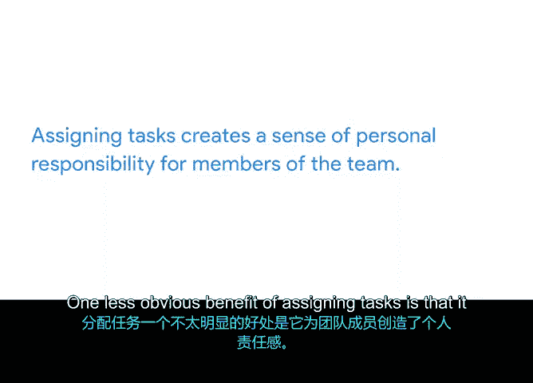

# 008：将一切整合起来

## 08_01_05：创建工作分解结构 📊

在本节中，我们将学习如何创建**工作分解结构**，这是一个将项目里程碑和任务按需完成的顺序进行层级化梳理的工具。通过它，我们可以将复杂的项目分解为更易管理的小块。

---

### 什么是工作分解结构？

上一节我们讨论了如何设定里程碑。现在，我们来看看如何规划构成每个里程碑的众多任务。

你可以通过创建工作分解结构来实现这一点。让我们从一个定义开始。

**工作分解结构**通常缩写为 **WBS**，是一种将项目的里程碑和任务按需完成的顺序进行层级化排序的工具。

这是一个非常有用的工具，因为它有助于将项目中有时令人望而生畏的挑战分解成更易管理的部分。像发布一份报告或组织一次会议这样的大型项目，当所需的工作被一步步分解，并有一条从项目开始到结束的清晰路径时，就显得不那么令人生畏了。

---

### 工作分解结构示例

让我们看一个基本的工作分解结构示例。

设计工作分解结构有很多不同的方法。但一种常见的方法是创建项目任务的树状图。

假设我们正在为“植物能源井”网站发布项目创建一个工作分解结构。在图表的顶部是项目名称。

图表的第二层将项目分解为三个里程碑。这些里程碑包括：**获得设计批准**、**开发网站**和**实施用户反馈**。

在图表的第三层，我们可以看到每个里程碑被进一步分解为一系列项目任务。例如，列在“获得设计批准”里程碑下的任务包括**制作设计模型**和**收集反馈**。

这是一个非常简单的工作分解结构示例。这里我们只为一个新网站创建了工作分解结构，而这只是“植物能源井”项目的一个可交付成果。请记住，在未来的项目管理角色中，你可能会创建一个概述整个项目任务的WBS。

同样重要的是要注意，虽然创建工作分解结构对于可视化项目任务是一个有用的练习，但你通常不会将这种类型的图表包含在正式的项目计划中。相反，你会将通过此练习确定的任务输入到电子表格或你选择的工作管理软件中，在那里你可以更轻松地为每个任务分配负责人。

---

### 分配任务

好的，那么在完成工作分解结构并将这些任务组织到电子表格中之后，有几件事对你来说应该更清晰了。

首先，你应该有一套构成每个里程碑的**独立项目任务**。你和你的团队成员将确切知道需要做什么才能达到第一个里程碑以及之后的里程碑。

其次，你现在处于一个很好的位置，可以将这些任务分配给项目团队的成员。每个人都应该清楚地了解他们负责的任务以及需要完成这些任务的顺序。

让我们分解一下如何分配任务。任务通常根据个人在项目中的角色来分配。

例如，在我们的办公室绿植场景中，网页设计师被分配了**制作初始网站设计模型**的任务。你被分配了**审查该设计并提供反馈**的任务。而设计师则被分配了**实施你的反馈**的任务。网站开发人员将被分配下一个任务，即**开发网站本身**。

有时，你的团队会有多个担任相同类型角色的成员。要在两个或更多具有相同角色的团队成员之间分配任务，你可能会考虑每个人对当前任务的熟悉程度。例如，如果你有多个网页开发人员负责新网站，你可能会让一名开发人员负责创建**着陆页**，而让另一名开发人员负责创建**联系我们页面**。

在分配任务时，你还应该考虑每个团队成员的工作量。思考一下他们计划在项目上花费的时间，与他们可能还需要负责的项目外工作相比。保持每个人的工作量平衡很重要。你要确保单个团队成员没有被分配比其他成员更多的工作。你还要确保没有人被分配超出其处理能力的工作量。当人们感到超负荷时，他们的工作质量可能会下降，或者他们可能需要更多时间来完成一定数量的任务，从而使时间表和整体项目进度面临风险。

作为项目经理，你将确保你的团队成员清楚他们被分配的任务。你可以借助像 **Asana** 这样的项目管理工具来分配任务，我在谷歌的日常工作中就经常使用它。当你在Asana中管理项目时，你将添加任务来代表完成项目所需的具体工作。

一个最佳实践是，每个任务最好以一个**动词**开头。例如，不要只输入“网站”，而要明确任务是“制作网站模型”或“为网站添加图片”。

分配任务时需要考虑的另一件事是**时间线**。确保为每个任务添加**负责人**和**截止日期**，以便清楚地知道谁在何时做什么。

最后，务必包含尽可能多的任务相关细节，以避免沟通不畅。在Asana中，你可以点击进入任务详情以添加有用信息。在这里，你可以添加描述、链接到相关文件或附件，甚至评论与任务相关的工作。

---

### 分配任务的好处

分配任务有很多好处，但最大的好处是它能让你腾出精力专注于管理项目。这样，你可以放心地知道你的团队成员负责具体的工作。

但分配任务也有一些不太明显的好处。现在让我们进一步探讨这些好处。

分配任务的一个不太明显的好处是，它为团队成员创造了一种**个人责任感**。当你将一项任务分配给一个队友时，你就与那个人达成了一项协议，即他们将负责该任务直到完成。为团队成员创造一种主人翁意识很重要，因为这能让他们感觉对项目更有投入感。这也为他们提供了个人成长的空间。此外，它还能支持你作为一名善于授权的管理者的技能培养。最重要的是，它能保持团队的积极性，并激励他们按时完成工作。

虽然每个团队成员都应该对其分配的任务有责任感，但完全的主人翁感可能会让一些队友感到压力过大。如果是这种情况，项目经理鼓励队友在任务上相互支持是一个好主意。这对于建立整体的团队融洽关系也非常有益。

---

### 总结

本节课中，我们一起学习了**工作分解结构**以及如何为团队中的成员**分配任务**。工作分解结构帮助我们将大项目分解为可管理的任务，而清晰的任务分配则确保了责任明确和进度可控。在下一个视频中，我们将回顾过去几个视频所涵盖的内容。