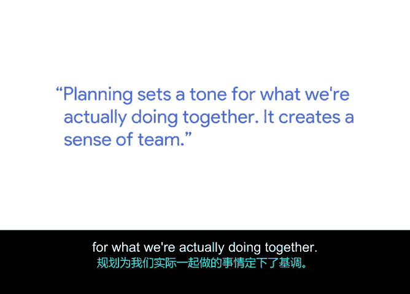

# 010：项目规划如何营造团队归属感 🎯

在本节课中，我们将学习项目规划阶段的核心价值，特别是它如何帮助团队建立共同目标、明确方向并营造归属感。我们将探讨规划的关键要素及其对团队协作的深远影响。

上一节我们介绍了项目规划的整体概念，本节中我们来看看规划如何具体地营造团队归属感。

规划阶段是项目管理中至关重要的环节。在这个阶段，你需要退后一步，反思项目的范围，即我们需要解决哪些问题。审视项目规划时，关键在于理解**你正在构建什么**、**为谁构建**以及**构建的时限**。

我们会评估风险，以确保了解哪些因素可能使项目脱轨。如果可能，我们会制定缓解措施来规避可能遇到的风险，或者至少对诸如范围蔓延之类的问题保持警觉。

我们同时会审视时间安排。是否存在必须达成的截止日期？如果存在，我们是否有足够的时间来达成它？

我们会评估需要完成的工作，以理解为了满足需求所需进行的工作是否能够适应我们已有的时间线。

我们还会审视测试计划，明确成功将是什么样子。这样我们就知道了目标，以便在达成并验证目标时，我们已经清楚预期获得的指标。

我是一个天生的规划者。规划为我们实际共同从事的工作定下了基调，它能创造一种团队感。

规划还能让每个人对齐理解我们共同追求的目标、我们的目的以及成功将呈现的模样。它确实是一个让我们汇聚一堂、确保所有人达成共识并朝着同一方向前进的场合。

当缺乏这种规划时，事情就会失控：你无法与正确的人沟通，会产生误解，项目会延误，并且你无法真正理解为何人们不乐于沟通进展。他们甚至可能不乐于在问题出现时进行沟通。

因此，你需要设定一种“我们同舟共济”的基调。我们将共同取得成功，我们必然会遇到障碍和问题，但我们将作为一个团队共同解决它们。

---

本节课中我们一起学习了项目规划在营造团队归属感方面的关键作用。我们了解到，规划不仅是关于范围、时间和风险的评估，更是关于**设定共同目标**、**确保团队对齐**以及**建立开放沟通的文化**。有效的规划能创造一个让每位成员都感到参与其中、方向一致且勇于面对挑战的协作环境。